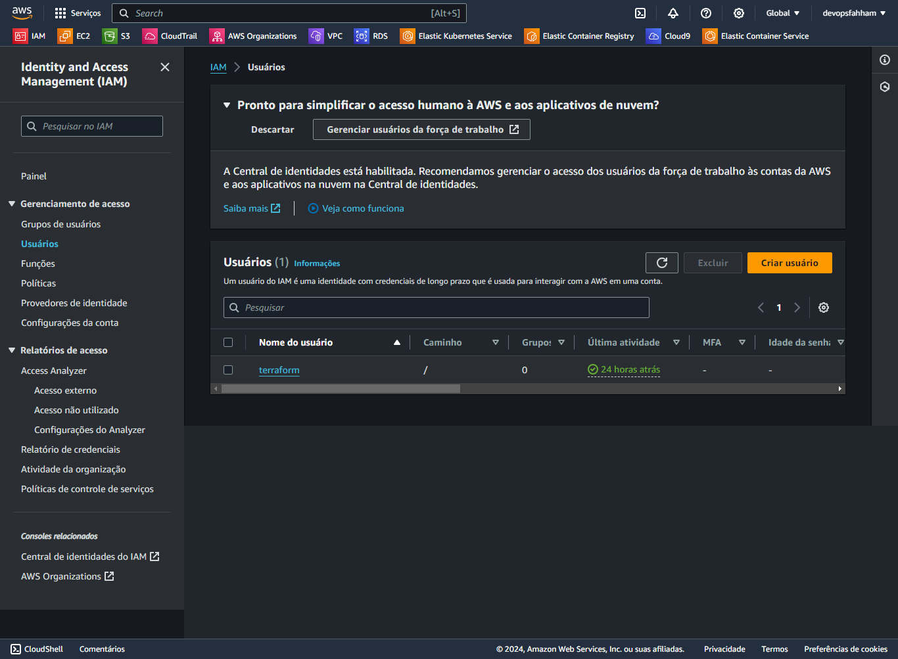
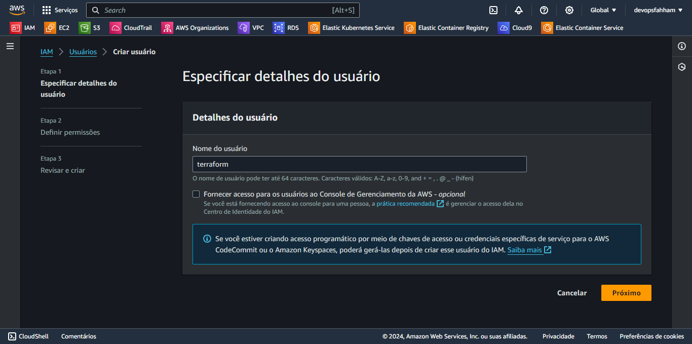
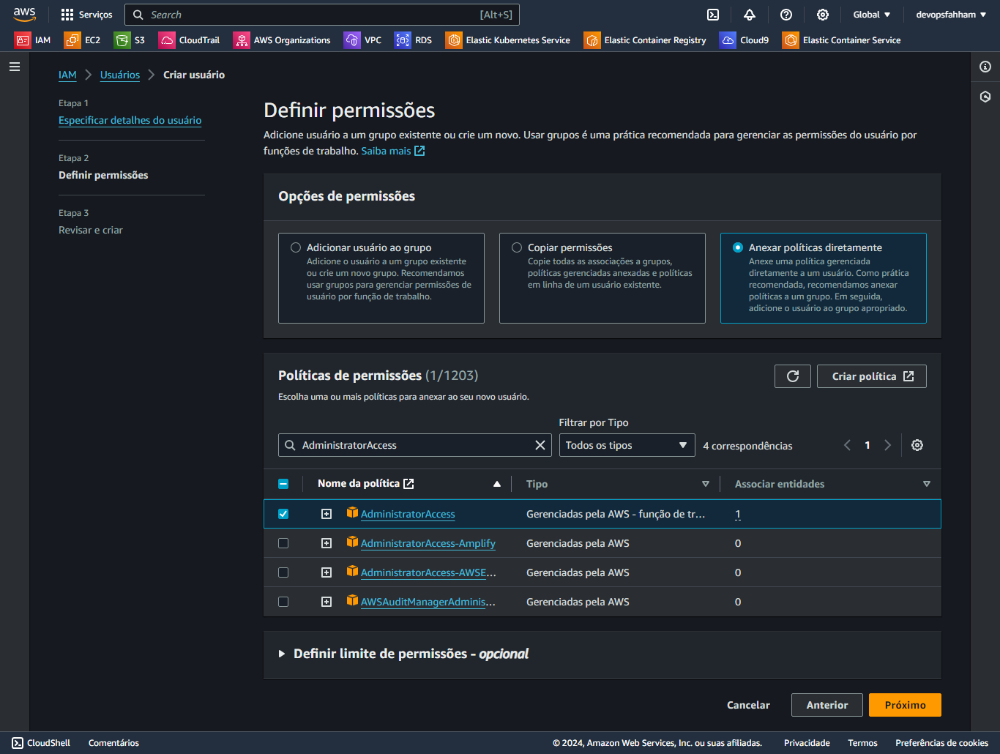
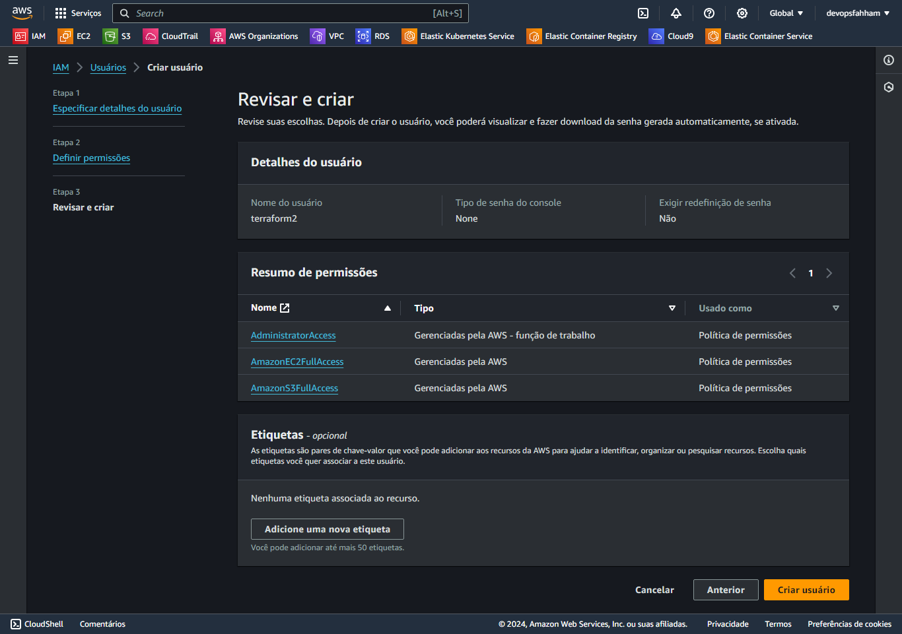

# Criando um usuário

Acessar o Painel do IAM

Procurar por Usuários

Criar Usuário

Adionar o Nome do Usuário

Adicionar as Políticas

    AdministratorAccess
    AmazonEC2FullAccess
    AmazonS3FullAccess

Concluir a criação do usuário

Importante!

Salvar as credenciais do usuário, um arquivo .csv, posteriormente será necessário para configurar o [AWS-CLI](aws-cli.md).