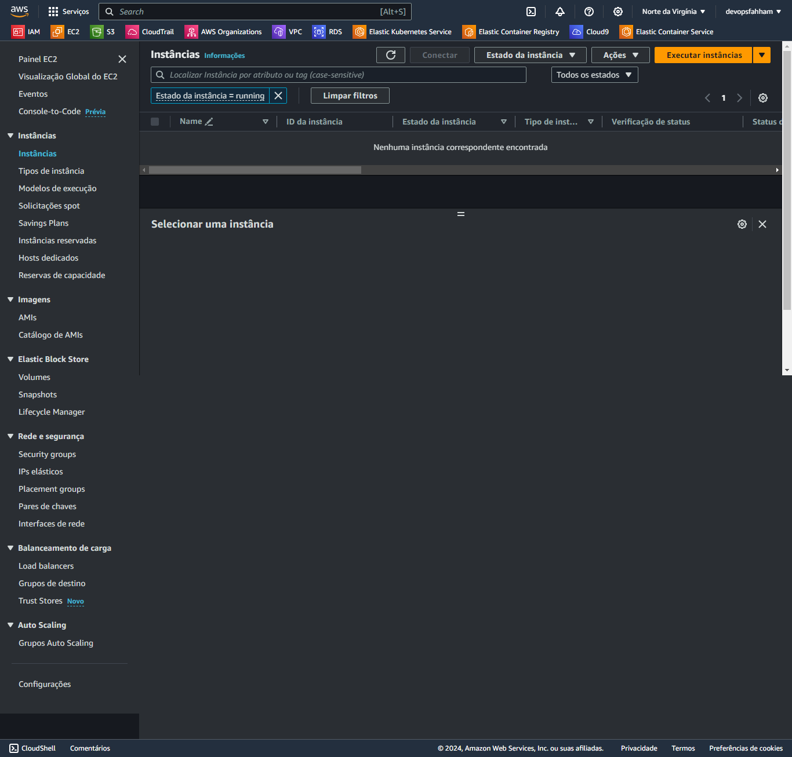
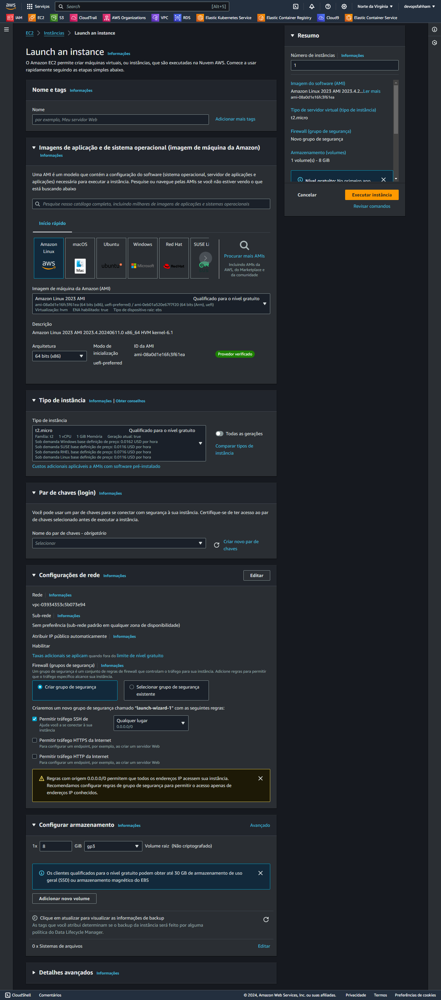
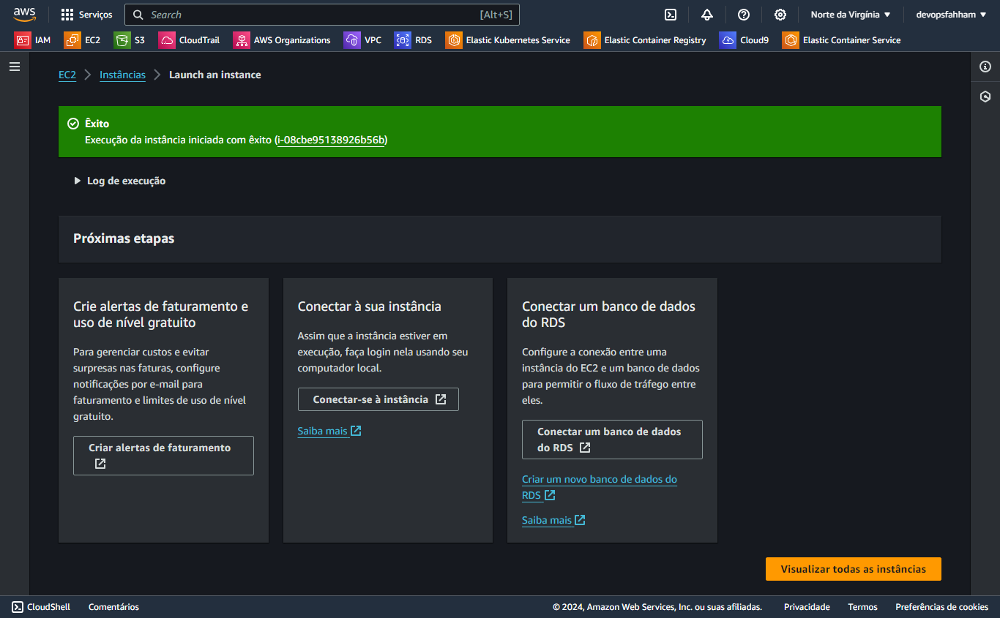
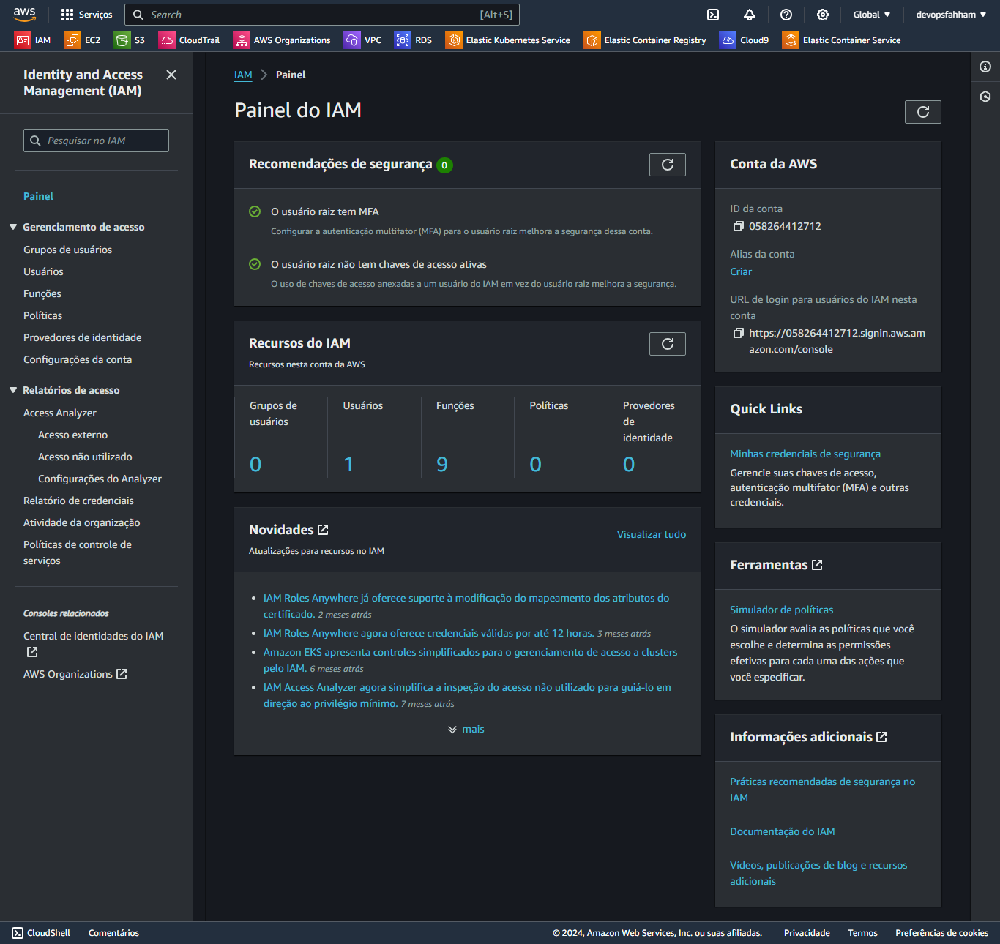
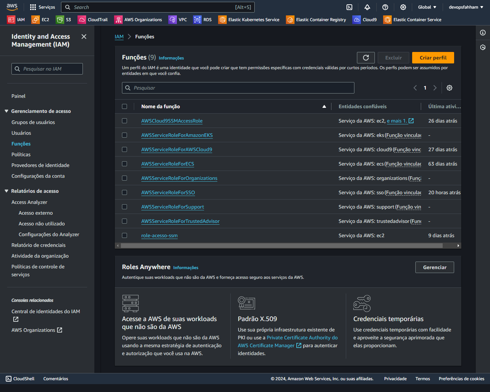
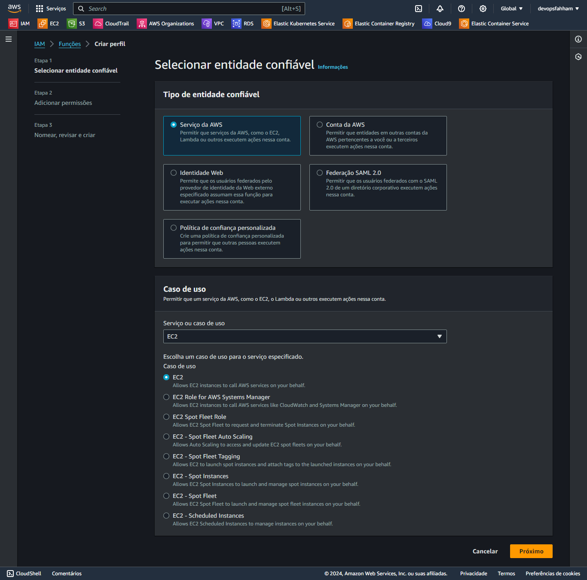
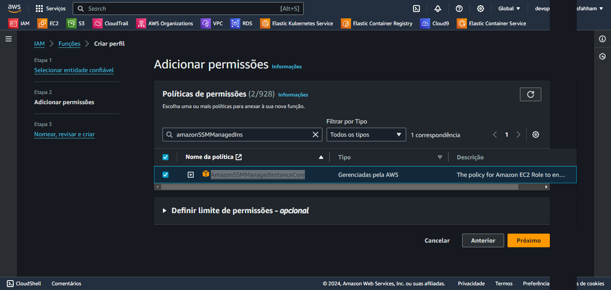
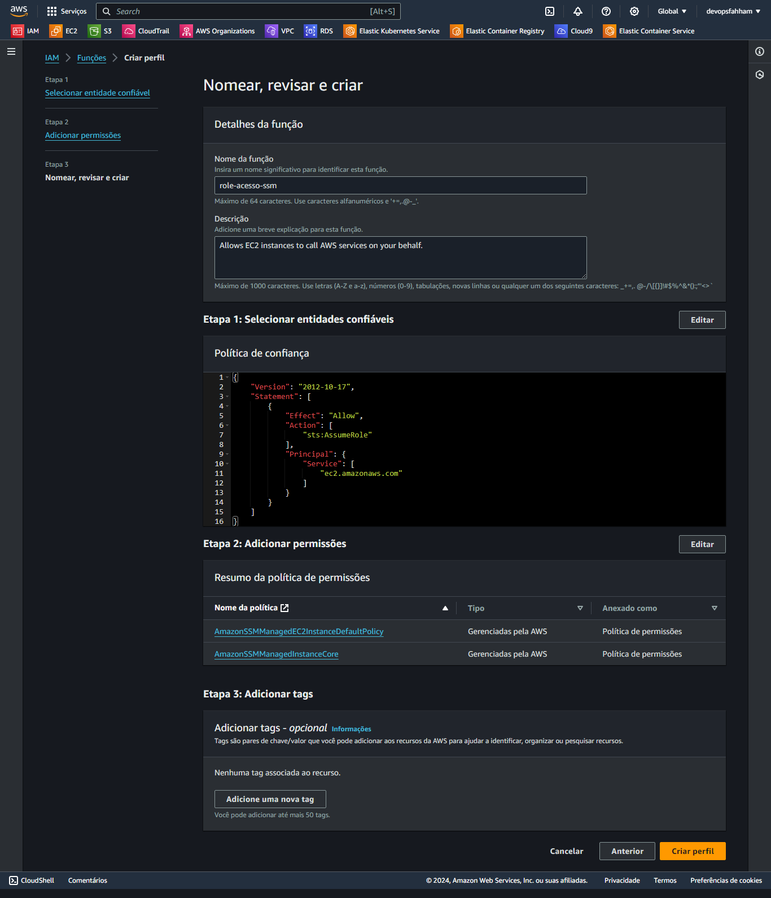
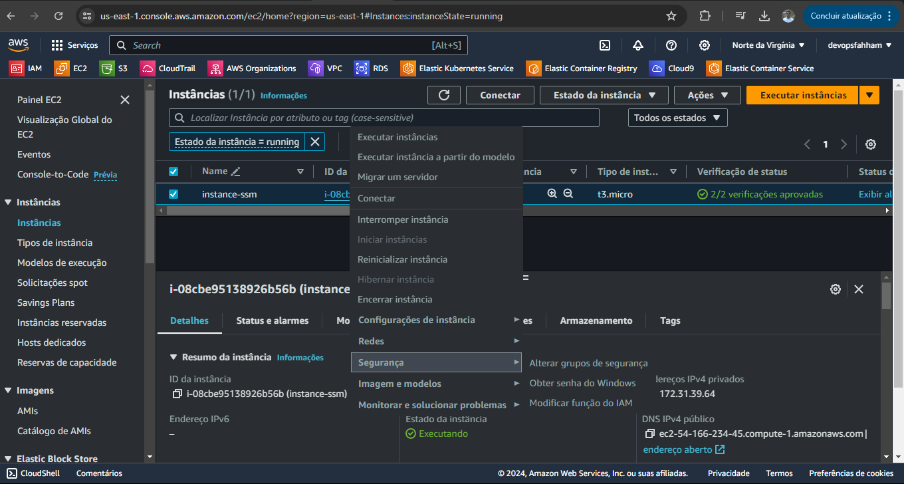
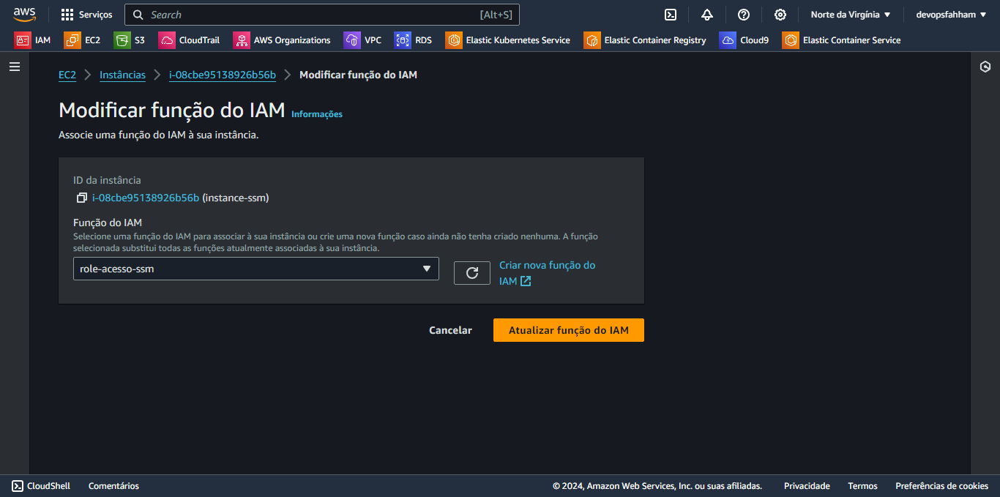

# Criando instâncias EC2

## Via console SSM

Dentro do console da AWS, procurar por EC2, na aba lateral procurar por Instâncias.

<div align="center">



</div>

Clicar em Executar Instâncias

<div align="center">



</div>

> Preencher

Nome da Instância: 

Escolher a imagem da Instância:

Escolher o Tipo da Instância:

Par de chaves (Prosseguir sem um par de chaves)

Selecionar um grupo de segurança existente: Default

Depois clicar em Executar Instância

<div align="center">



</div>

## Depois de criar a Instância, criar Role de acesso para a Instância

<div align="center">





</div>

Escolher AWS Service ou Serviço da AWS

> Permitir que serviços da AWS, como o EC2, Lambda ou outros executem ações nessa conta.

Caso de Uso, escolher EC2 <NEXT>

<div align="center">



</div>

Procurar pelo Nome da Política: AmazonSSMManagedInstanceCore

<div align="center">



</div>

Role Acesso SSM

<div align="center">



</div>

## Modificar a Role da Instância Criada

Clicar com o botão direito do mouse sobre a Instância criada

<div align="center">





</div>

## Para acessar

Usar o CloudShell

```bash
aws ssm start-session --target ID da instância
```


