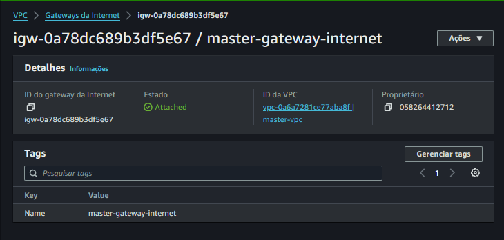
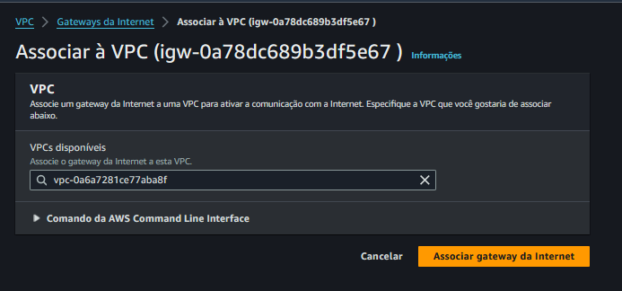

# Criando uma VPC

Acessar o Console ada AWS

Selecionar a região: us-east-1

Procurar por VPC

## Clicar em Criar VPC

## Criar as sub-redes

Clicar em sub-redes

Criar sub-rede publica e privada

## sub-redes Criadas

# CIDR

Classless Inter-Domain Routing ou Domínios Sem Classificação 

> O CIDR permite flexibilidade na criação de super redes, o que não é possível na arquitetura de mascaramento convencional. Por exemplo, sua organização pode combinar endereços IP em um único bloco de rede usando uma notação como esta: 192.168.1/23.

https://aws.amazon.com/pt/what-is/cidr/

## Criar as Instâncias

> instance-public

> instance-private - Não tem endereço públic

## Internet Gateway

Habilitar para que a instance-public possa ter acesso da internet.

Em VPC, Gateways da Internet

- Criar Gateway de Internet

    - Nome: mastre-gateway-internet

- Associar

    - Associar a vpc criada

## Criando Tabela de Rota de saída no Internet Gateway

Em VPC / Tabelas de Rotas

Criar tabela de rotas (public e private)

Nome: master-route-table-public

e

Procurar por associação de sub-rede

# Editar Rotas

## NAT GATEWAY

Acesso só de saída - Out

Utilizado para instalar os programas.

VPC / Gateways Nat

Nome: master-nat-gateway

Criar a Rota de EC2 para o NAT GATEWAY

