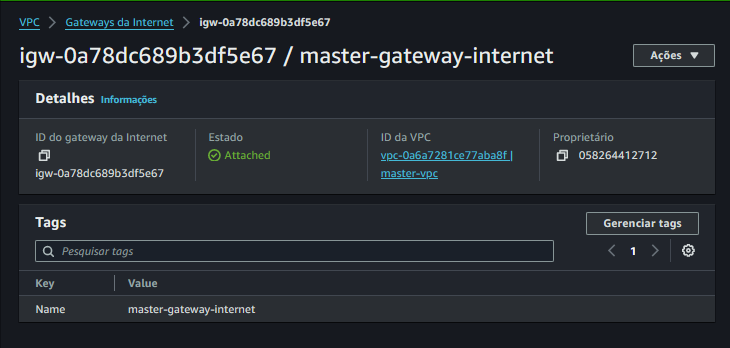
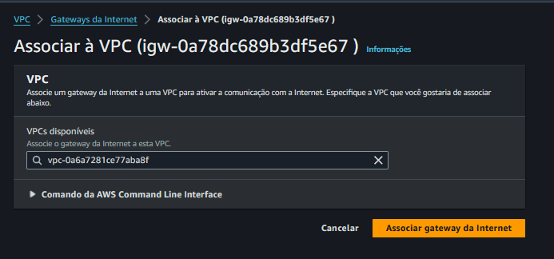

## Internet Gateway

Habilitar para que a instance-public possa ter acesso da internet.

Em VPC, Gateways da Internet

- Criar Gateway de Internet

    - Nome: master-gateway-internet

- Associar

    - Associar a vpc criada

> Próximo passo...

