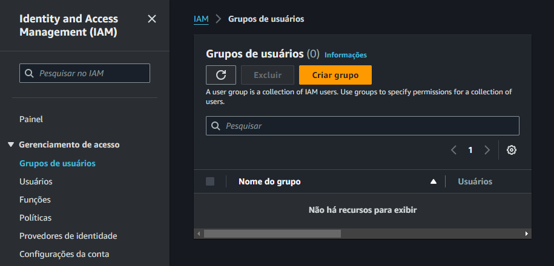
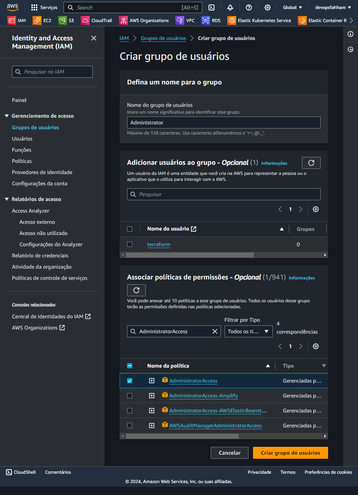

# Grupos de usuários

Definir acesso a determinado serviço da AWS a um grupo restrito de usuários

Criar o Grupo

No Painel do IAM, procurar por grupos de usuários, depois em `Criar Grupo`.

- Adicionar o nome do grupo de usuários: 
    - `Administrator`

- Adicionar usuários ao grupo - Opcional

- Associar políticas de permissões - Opcional
    - Nome da política: `AdministratorAccess`

Confirmar a criação, clicando em `Criar grupo de usuários`

Próximo passo... [Criar usuário](../usuario/criar.md).