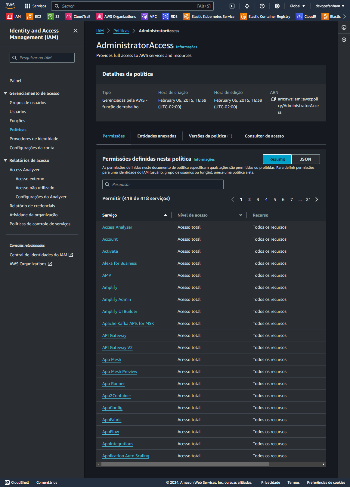

# Polices

Você controla o acesso na AWS criando políticas e anexando-as às identidades do IAM ou aos recursos da AWS.

Uma política é um objeto na AWS que, quando associado a uma entidade ou recurso, define suas permissões. A AWS avalia essas políticas quando um principal, como um usuário, faz uma solicitação. As permissões nas políticas determinam se a solicitação é permitida ou negada. A maioria das políticas é armazenada na AWS como documentos JSON.

Mais infromações: https://docs.aws.amazon.com/robomaker/latest/dg/auth_access_what-are-policies.html

