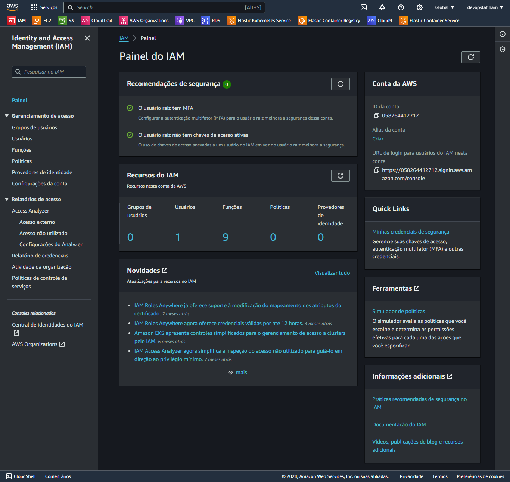
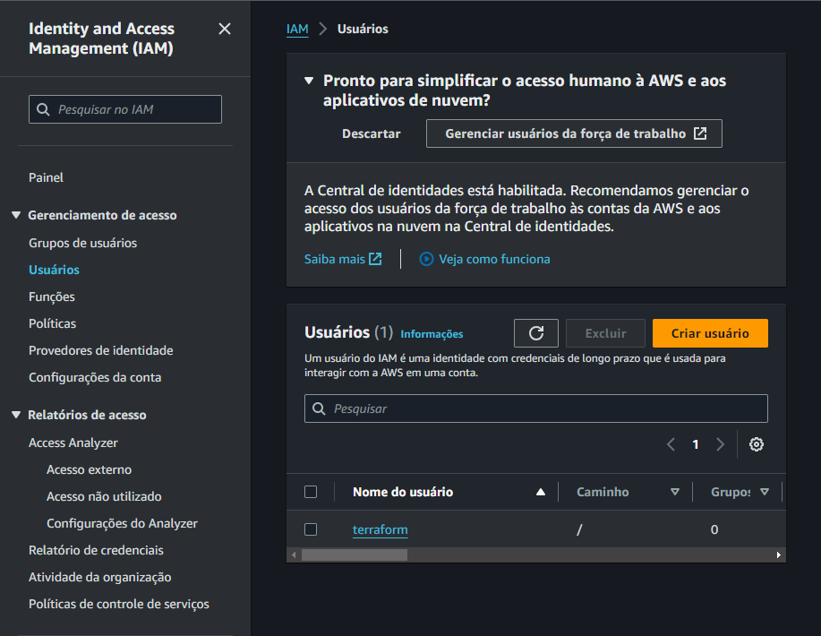
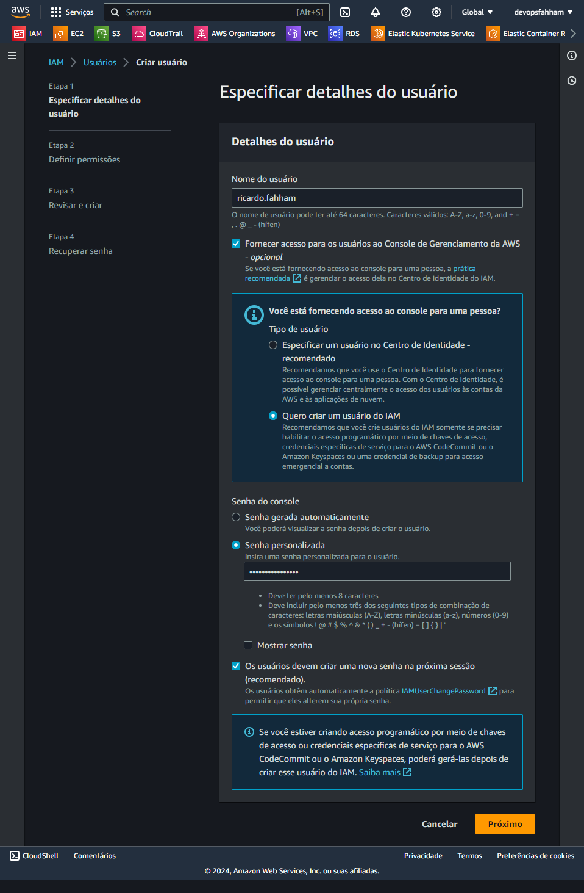
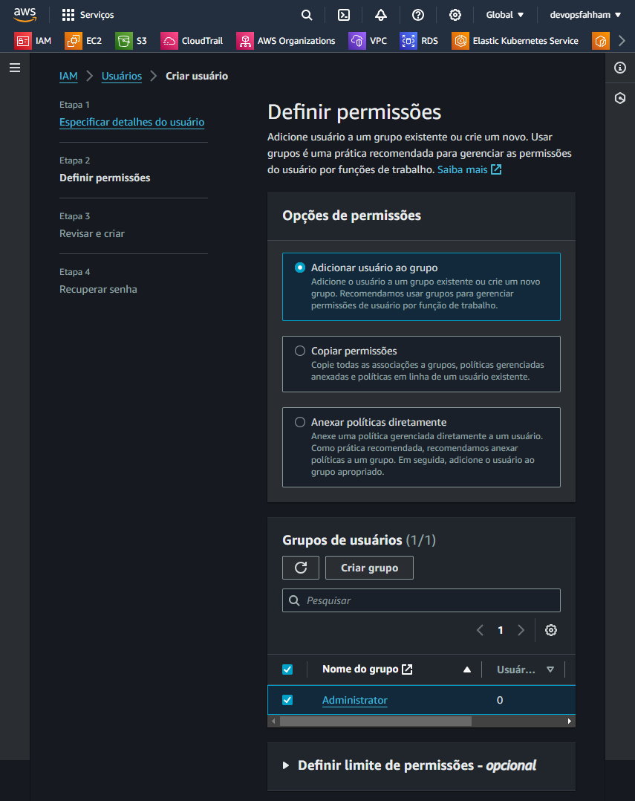
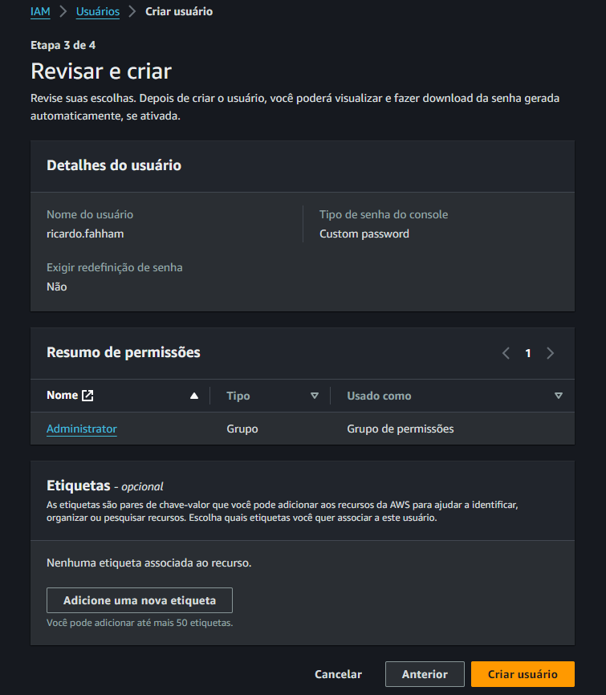
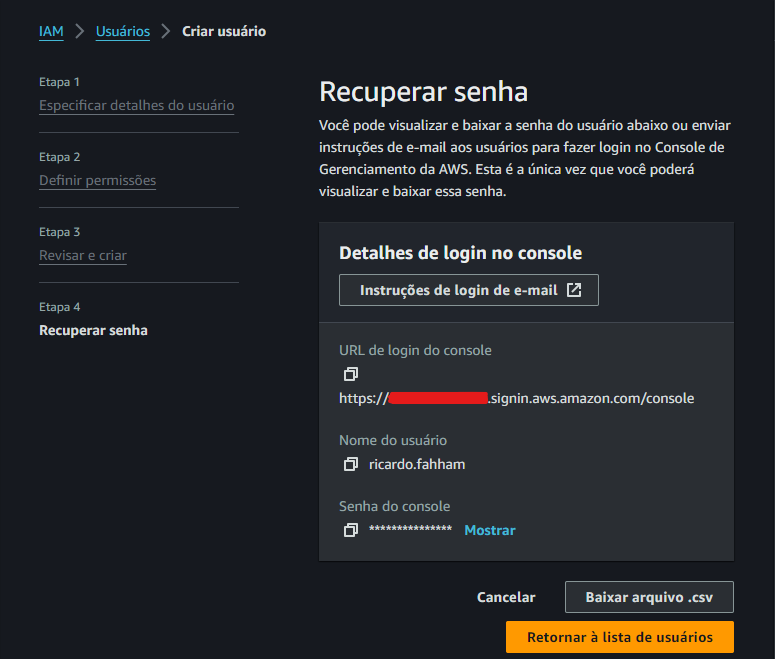
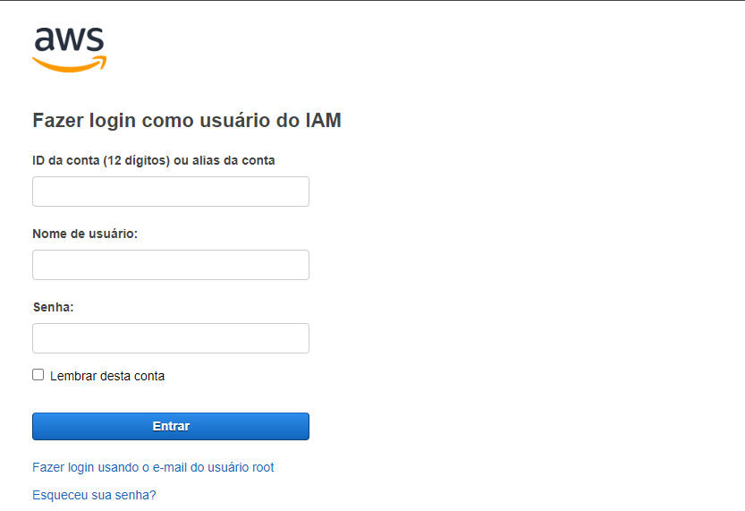

# Criando um usuário

Só pode ser feito pelo usuário **ROOT**

Acessar o Painel do IAM

Procurar por Usuários

Clicar em `Criar usuário`

Adionar o Nome do Usuário

Selecionar, `Fornecer acesso para os usuários ao Console de Gerenciamento da AWS - Opcional`

Senha do Console

Pode gerar uma senha padrão (pernonalizada) e pedir para que o usuário troque no primeiro acesso.

Clicar em `Próximo/Next`

## Adicionar Usuário ao Grupo, criado anteriormente.

## Revisar e Criar

Clicar em `Criar usuário`

## Instruções de login de e-mail

Depois de criado o usuário

Acessar com o link informado na criação 

Informar:

> Nome:

> Senha:

