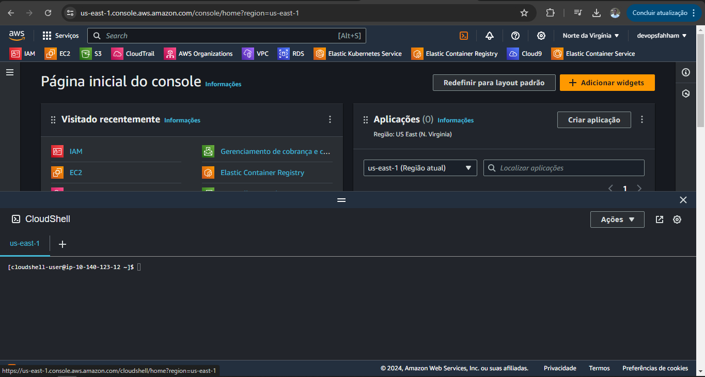

# Acesso pelo CloudShell

## Utilização da AWS CloudShell para operação com o AWS Identity and Access Management

> O AWS CloudShell é um shell pré-autenticado baseado em navegador que você pode iniciar diretamente do AWS Management Console. É possível executar comandos da AWS CLI para serviços da AWS (incluindo o AWS Identity and Access Management) usando o shell de sua preferência (Bash, PowerShell ou Z shell). E você pode fazer isso sem precisar baixar ou instalar ferramentas de linha de comando.

> Você inicia a AWS CloudShell via AWS Management Console, e as credenciais da AWS que usou para fazer login no console estarão automaticamente disponíveis em uma nova sessão do shell. Essa pré-autenticação de usuários da AWS CloudShell permite que você pule a configuração de credenciais ao interagir com serviços da AWS como o IAM usando a AWS CLI versão 2 (pré-instalada no ambiente computacional do shell).

O CloudShell é um ambiente que é disponibilizado pela AWS com algumas ferramentas pré-instaladas

- Docker
- Python

Documentação: https://docs.aws.amazon.com/pt_br/IAM/latest/UserGuide/using-aws-with-cloudshell.html