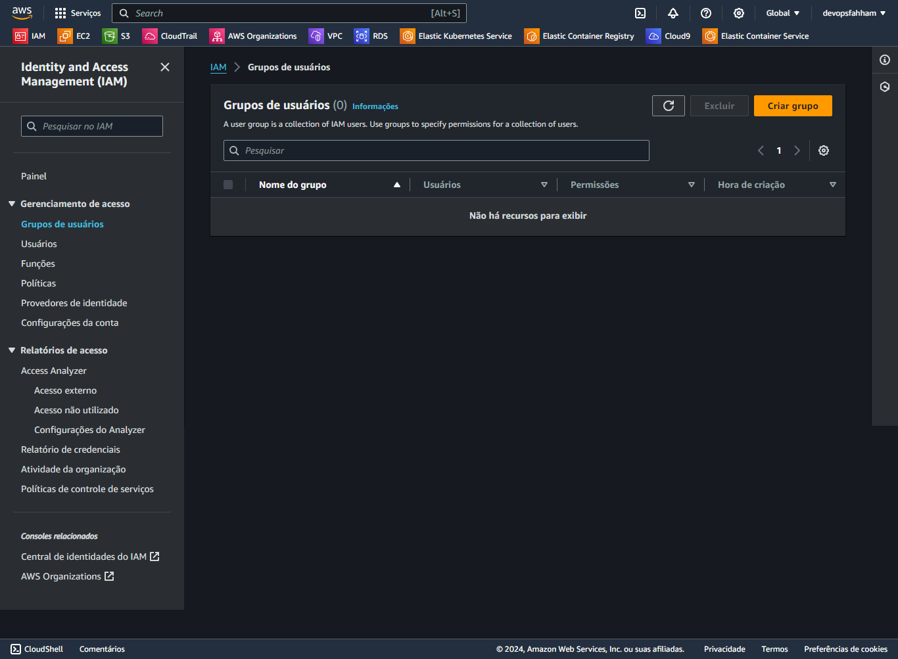
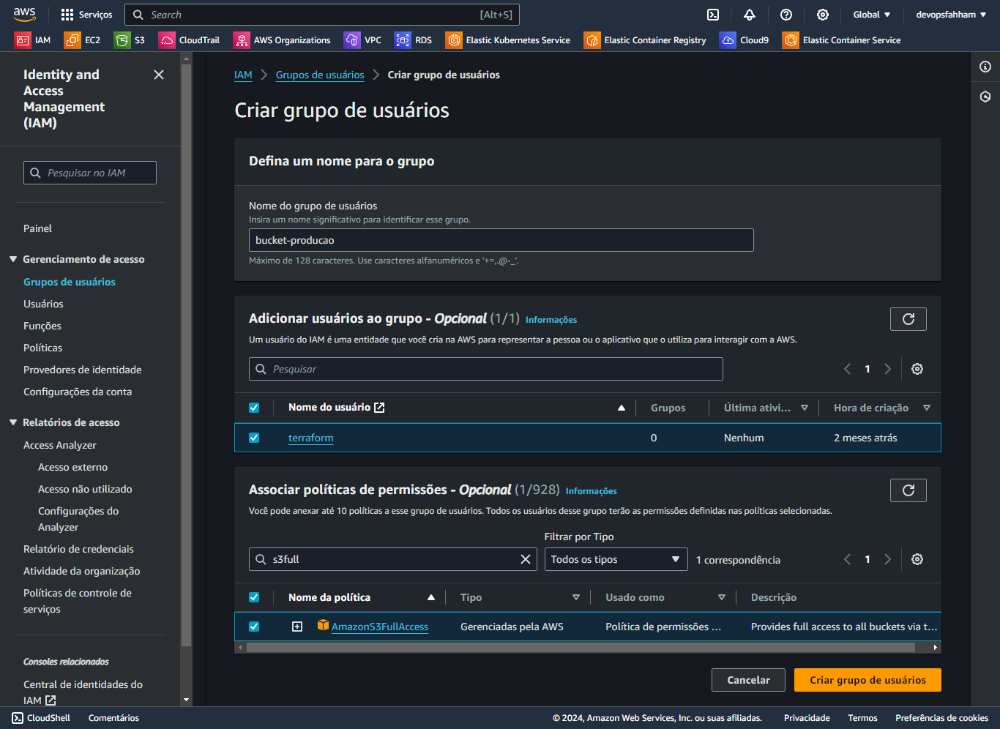

# Grupos de usuário

Definir acesso a determinado serviço da AWS a um grupo restrito de usuários

Criar o Grupo

Adicionar o nome do grupo de usuários

Adicionar usuários ao grupo - Opcional

Associar políticas de permissões - Opcional

Próximo passo... [Criar usuário](../usuario/criar.md).