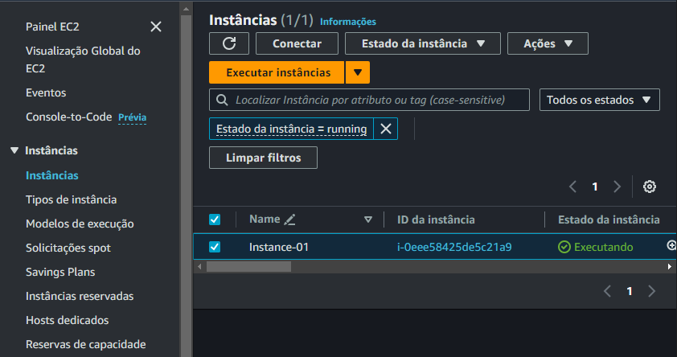
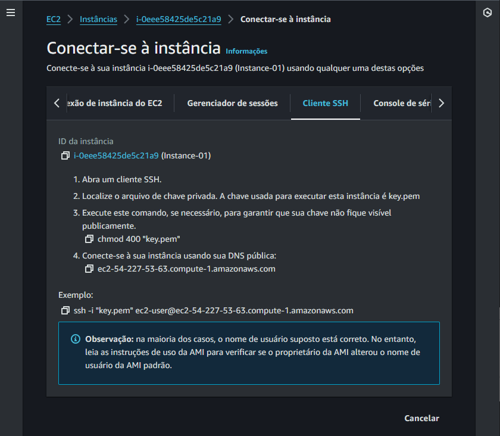
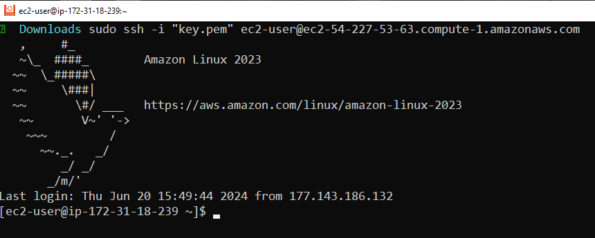

# Acessar a instância

Acessar o console

Procurar por EC2

Instâncias

<div align="center">



</div>

Selecionar a instância desejada

Clicar em Conectar

<div align="center">



</div>

Acessar o seu terminal, seja no MAC, no Windows ou Linux.

Seguir a recomendação da imagem acima...

```bash
sudo ssh -i "key.pem" ec2-user@ec2-54-227-53-63.compute-1.amazonaws.com
```

<div align="center">



</div>

