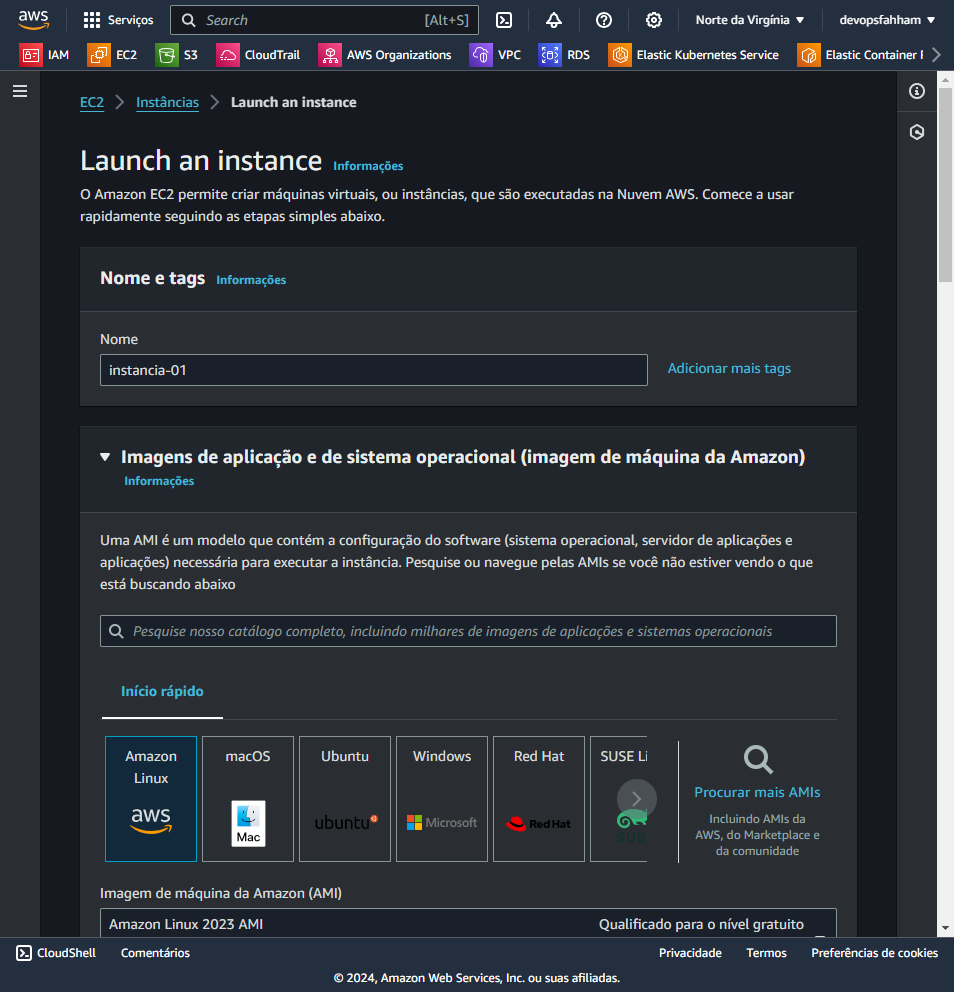
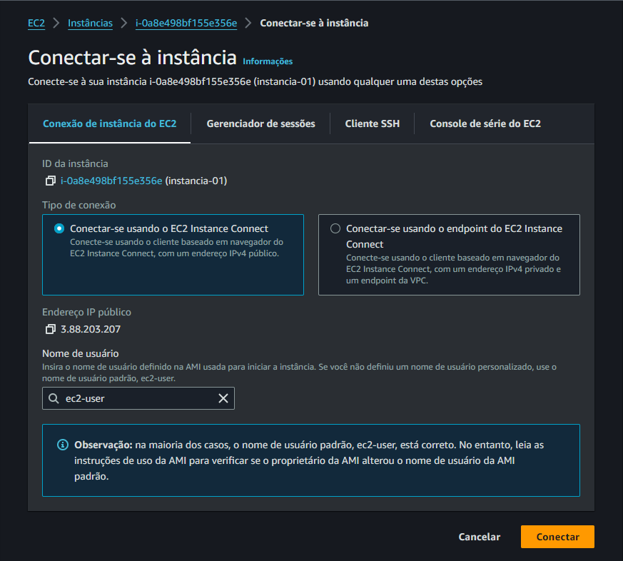
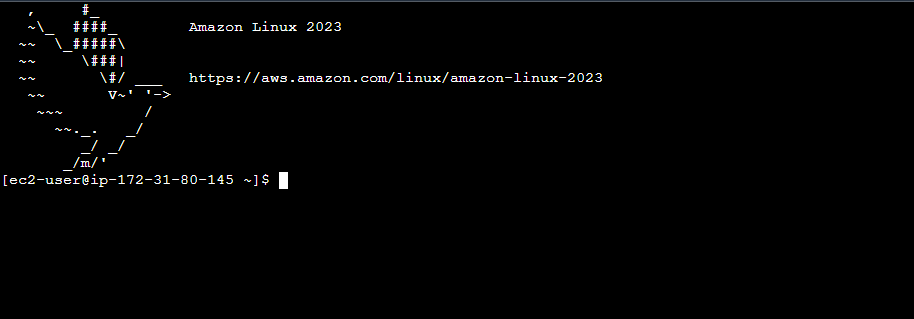

# Acesso a instância

## Via Console

Criar a instância...

- Sem par de chaves
- Criar Security Group
    - Criaremos um novo grupo de segurança chamado “launch-wizard-3” com as seguintes regras:
        - Permitir tráfego SSH de: Qualquer lugar: 0.0.0.0/0

Importante!!!
Ter cuidado com o acesso muito permissivo para a infra, a sugestão é configurar o Security Group para acesso somente a sua máquina(IP) 

Clicar na instância criada e depois em Conectar

Conectado

Lembrar de destriuir a instância quando não for mais usada, gera custos...