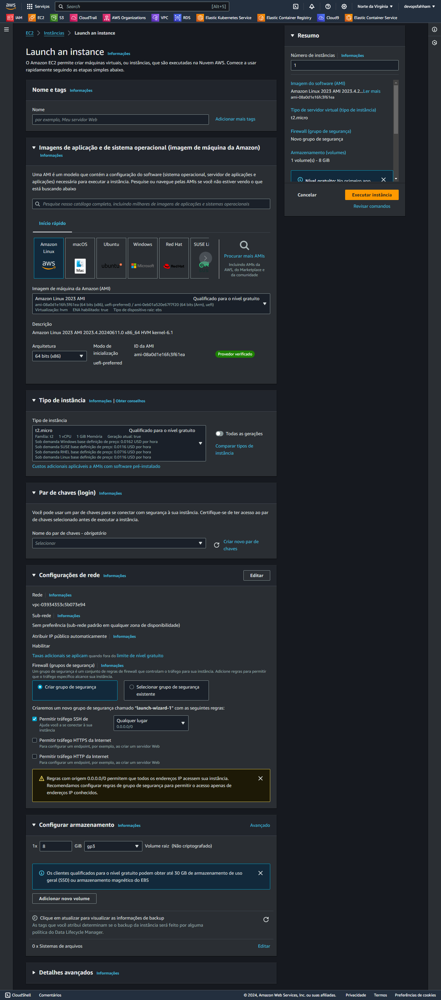

# Criar uma Instância via Console

Acessar o Console da AWS

Procurar por EC2

Primeiro... [Criar um grupo de segurança (Security Group)](./security-group.md)

Clicar em Executar Instâncias

> Preencher

Nome da Instância: instance-01

Escolher a imagem da Instância: AWS LINUX

Escolher o Tipo da Instância: t2.micro

Par de chaves: criar novo pr de chaves (o download é auomático)

Selecionar um grupo de segurança existente: 

Depois clicar em Executar Instância

> Próximo passo... Acessar a instância...

[Via console](../acessar/console.md)
[Via cli](../acessar/cli.md)
[Via console SSM](../acessar/console-ssm.md)