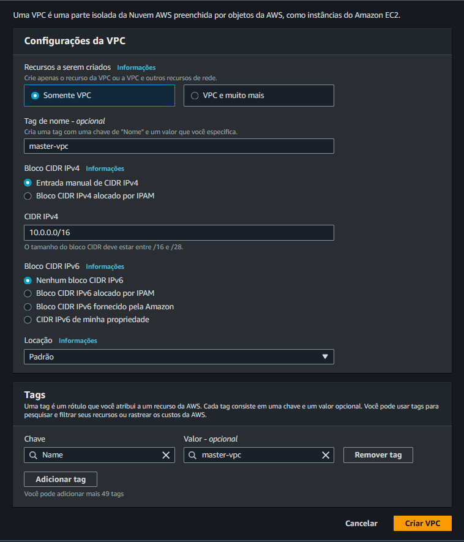

# 1 - Criando uma VPC

> Acessar o Console da AWS

> Selecionar a região: us-east-1

> Em Search, procurar por VPC

## Clicar em Criar VPC

Dar nome para a nova VPC: `master-vpc`

Bloco CIDR ipv4: `10.0.0.0/16`

Confirmar com Criar VPC

> Próximo passo... [Criar a subnet](../vpc/subnet.md) .

