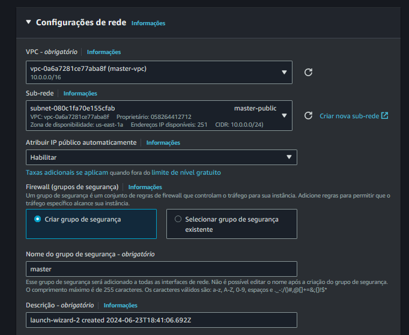
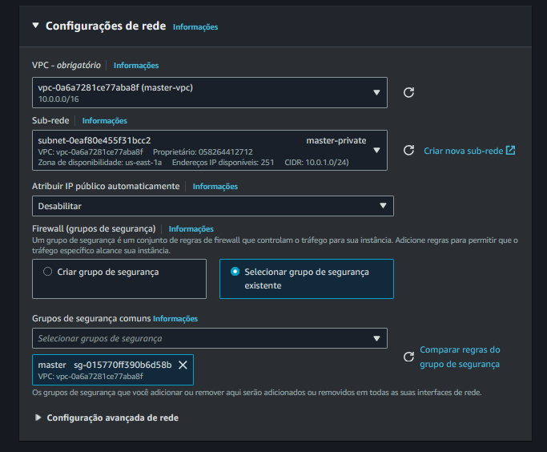

# 7 - Criar as Instâncias

## instance-public

Em Configuração de Rede...

> Escolher a VPC

> Definir a sub-rede pública

> Atribuir um IP Público: Habilitar

> Selecionar o Security-Group

## instance-private

Em Configuração de Rede...

> Escolher a VPC

> Definir a sub-rede privada

> Atribuir um IP Público: Desabilitar

> Selecionar o Security-Group

> Próximo passo... [Acesso SSH](./ssh.md) .