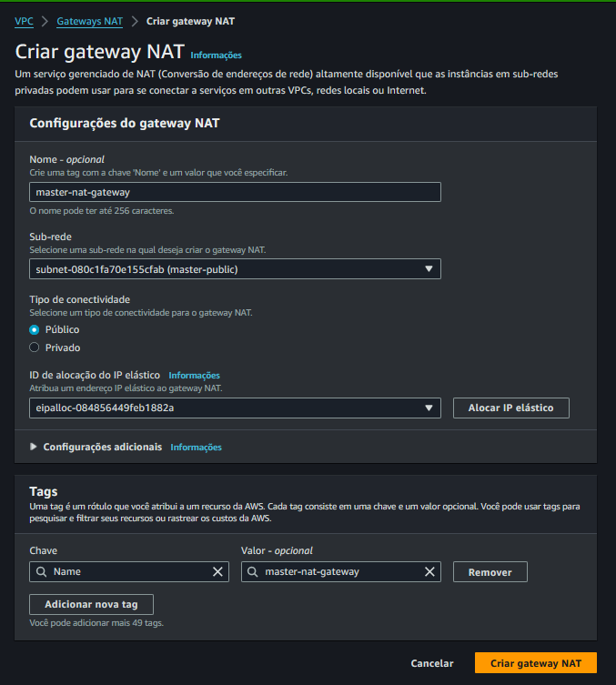

# 4 - NAT GATEWAY

Liberar acesso da Rede privada para acesso a internet

Acesso só de saída - Out

Utilizado para instalar os programas.

VPC / Gateways Nat

Nome: master-nat-gateway

> Próximo passo... [Tabela de Rotas](./route-tables.md) .

