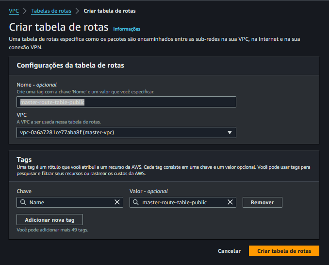
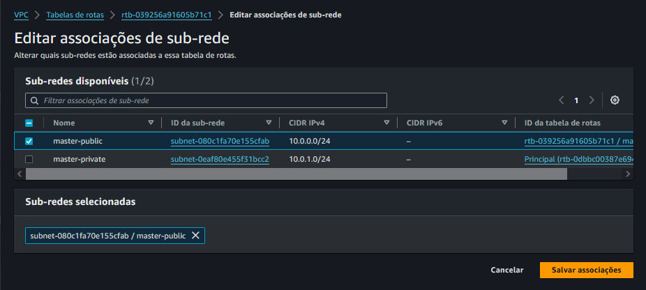
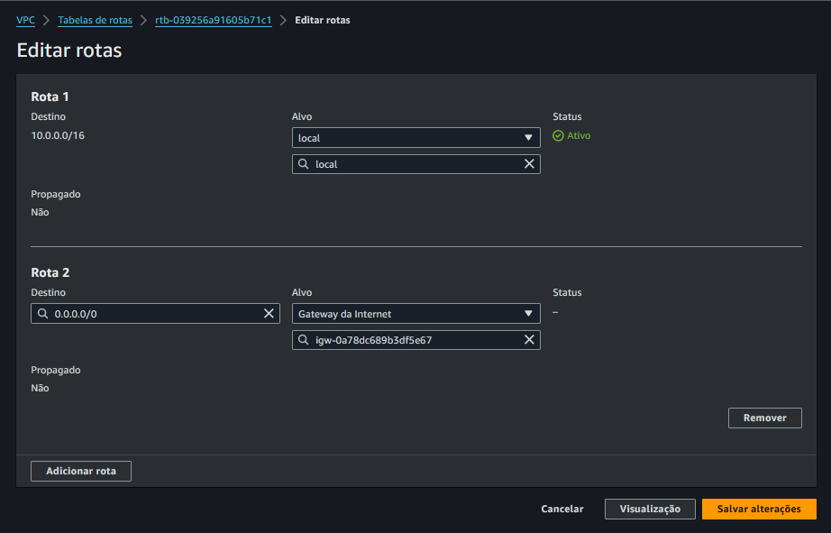

# 5 - Criar a Route Tables

Criando Tabela de Rota de saída no Internet Gateway

Em VPC / Tabelas de Rotas

Criar tabela de rotas (public e private)

Nome: master-route-table-public

VPC: 

e

Procurar por associação de sub-rede

Associar a Tabela de Rota só para a sub-rede pública

## Editar Rotas

Adicionar rota

Destino: 0.0.0.0/0

Alvo: Internet gateway

Criar a Tabela de Rota da EC2 privada para o NAT GATEWAY

Nome: master-route-table-private

Selcionar VPC

Procurar por associação de sub-rede

Associar a Tabela de Rota só para a sub-rede privada

Salvar 

Editar Rota

0.0.0.0/0

Alvo: Nat Gateway

> Próximo passo... [Security Group](../vpc/security-group.md)

