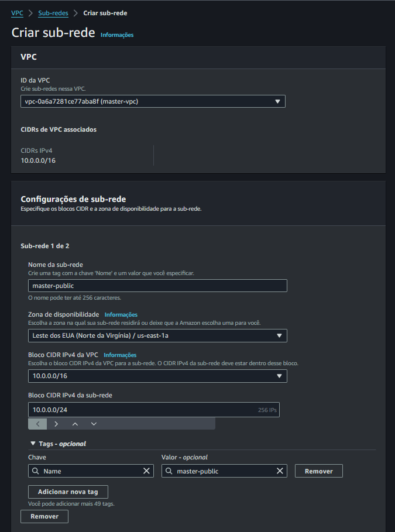
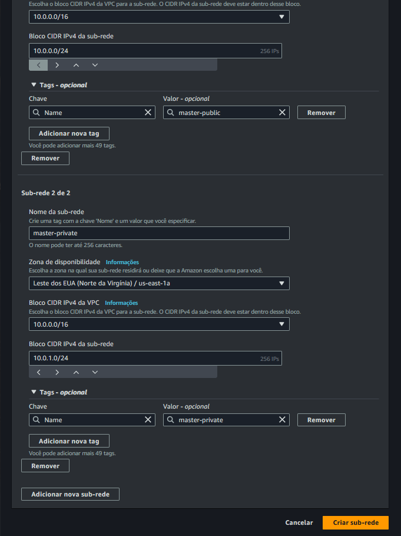

# 2 - Criar as subnets

Clicar em subnets

Crie sub-redes nessa VPC...

Selecionar a VPC

## Criar sub-rede publica (1 de 2)

Nome da vpc pública: master-public

Zona de disponibilidade: `us-east-1a`

Bloco CIDR ipv4 da sub-rede: 10.0.0.0/24

## Criar sub-rede privada (2 de 2)

Nome da vpc privada: `master-private`

Zona de disponibilidade: `us-east-1a`

Bloco CIDR ipv4 da sub-rede: `10.0.0.0/24`

## Sub-redes criadas

> Próximo passo... [Criar Internet Gateway](./internet-gateway.md) .