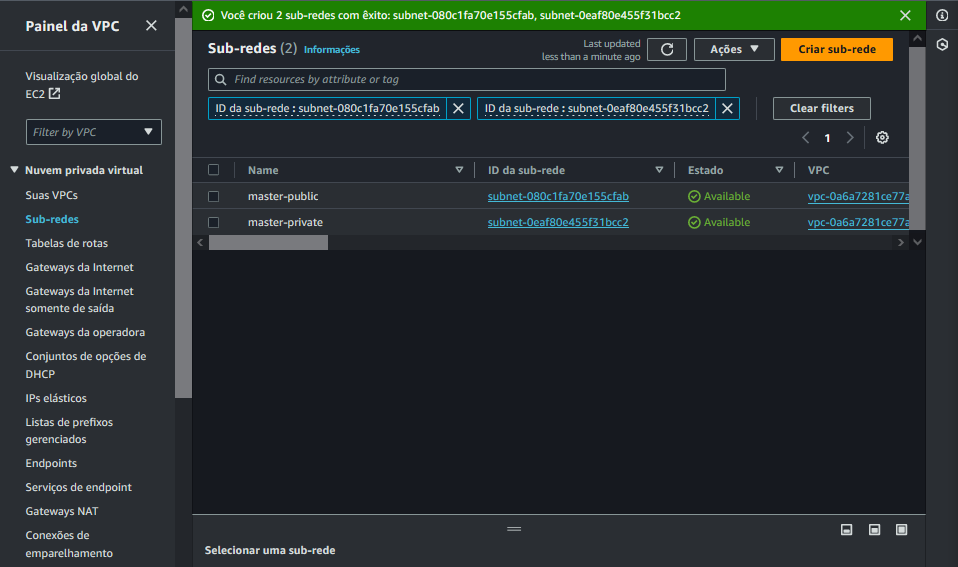

# 2 - Subnet

Uma subnet (ou subrede) nada mais é do que um trecho de IPs dentro da VPC. Se por exemplo sua VPC tem um CIDR block de 172.31.0.0/16, significando que o VPC pode ter os IPs 172.31.0.0 até 172.31.255.255 *, um subnet pode ter um pedaço disso, como 172.31.0.0 até 172.31.0.255 e outra subnet pode ser 172.31.1.0 até 172.31.255.255 , efetivamente tendo duas subnets dentro dessa VPC (*a AWS usará alguns desses IPs para uso interno).

A principal razão de separar VPCs em subnets é ter um controle mais fino sobre a VPC, especialmente quando se cria uma subnet pública ou privada nela, ou seja, trechos da VPC que vão ter acesso a internet e o mundo externo e trechos que serão privados e escondidos do mundo externo, por razões de segurança (e talvez o código PHP feio que você que quer esconder de todos).

Repare que as subnets criadas por padrão pela AWS estão cada uma dentro de uma availability zone (AZ), por isso que algumas regiões tem mais subnets padrão do que outras. Caso for criar uma nova subnet, é obrigatório selecionar em qual AZ essa subnet vai pertencer. Para não perdermos o foco agora, discutiremos AZs em um próximo post.

É dentro de subnets que são criados os grupos de segurança (security groups — SG) onde regras mais granulares de segurança, como quais protocolos e IPs podem acessar um dado recurso seu (inbound rules) e para quais IPs e protocolos os seus recursos podem se conectar (outbound rules). São essas regras que efetivamente tornam uma subnet como pública ou privada e, dependendo onde você adicionar seu recurso, como uma instância EC2, vai determinar se o recurso terá acesso ao mundo externo ou não e quem vai poder acessá-lo.

## Criar uma subnet

Clicar em subnets

Crie subnet nessa VPC...

Selecionar a VPC

## Criar subnet publica (1 de 2)

Nome da vpc pública: master-public

Zona de disponibilidade: `us-east-1a`

Bloco CIDR IPv4 da VPC: `10.0.0.0/16`

Bloco CIDR ipv4 da subnet: 10.0.0.0/24

## Criar subnet privada (2 de 2)

Nome da vpc privada: `master-private`

Zona de disponibilidade: `us-east-1a`

Bloco CIDR IPv4 da VPC: `10.0.0.0/16`

Bloco CIDR ipv4 da subnet: `10.0.0.0/24`

## Subnets criadas

> Próximo passo... [Criar Internet Gateway](./internet-gateway.md) .