# Criando RDS via Console

> Data: 12/07/2024

No console da AWS, procurar por RDS

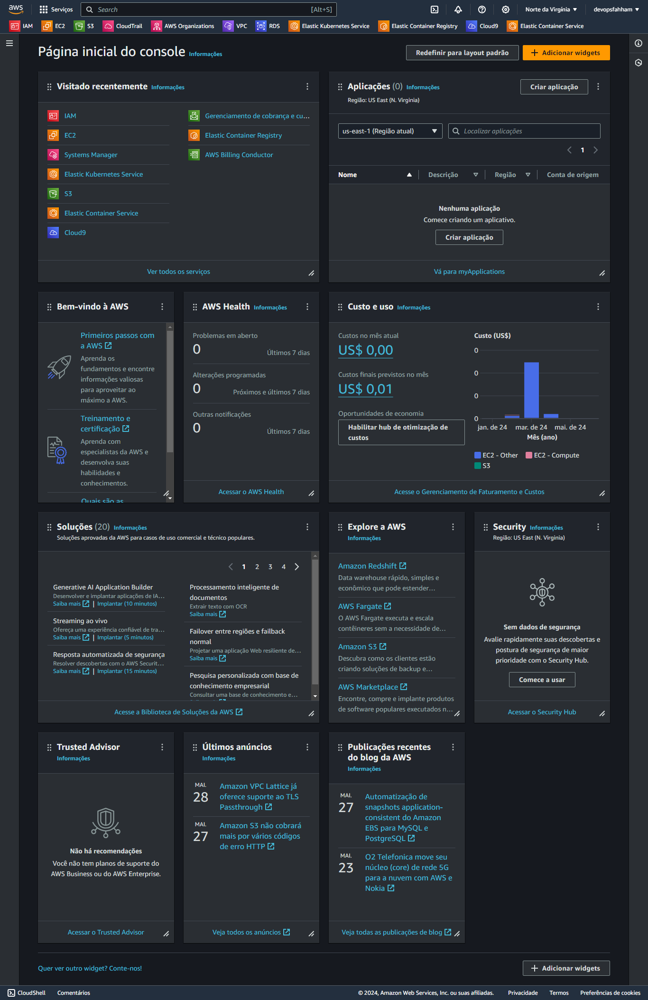

## Create Database

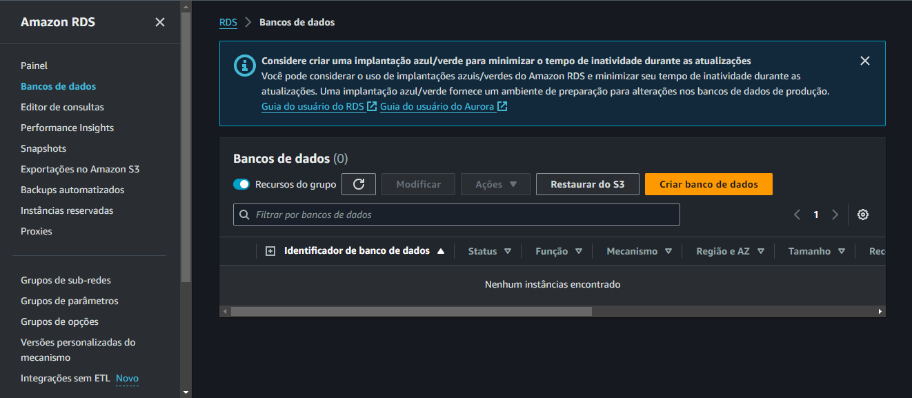

## Opções de mecanismo

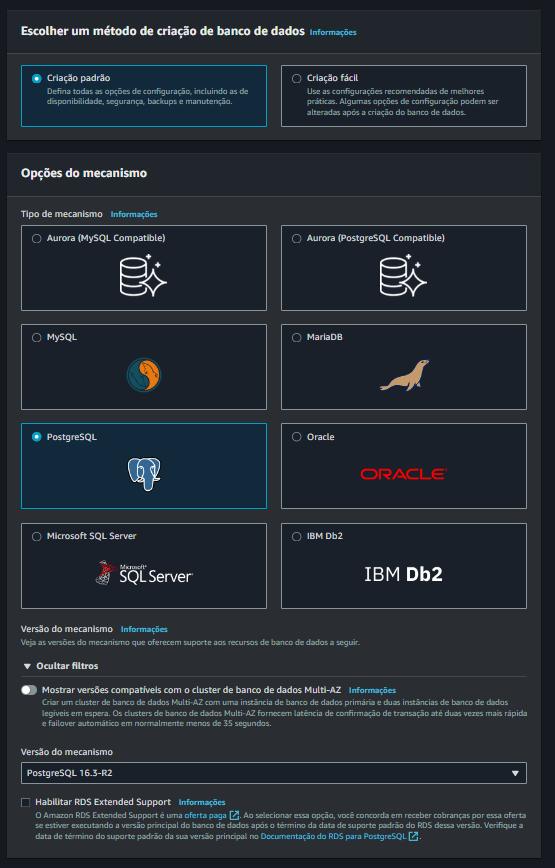

- Selecionar o tipo: PostgreeSQL

- Engine Version: 16.3-r2

## Modelo

Templates: Free Tiar

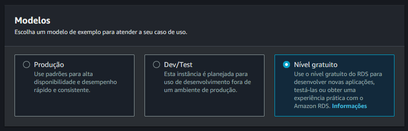

## Config

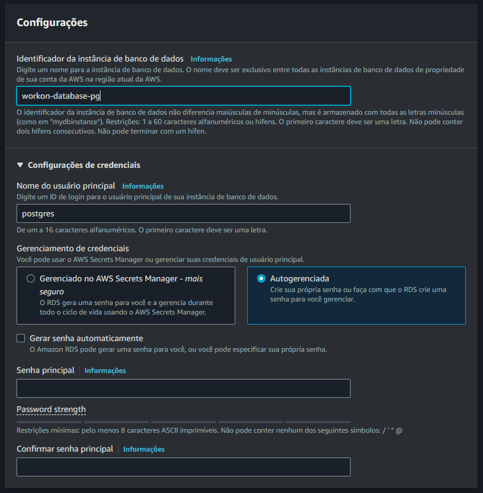

- DB instance Identifier: workon-database-pg

- Credentials Settings: selecionar Auto generate a password

- Existing VPC security group: workon-db (ciando anteriormente)

## Config Instância

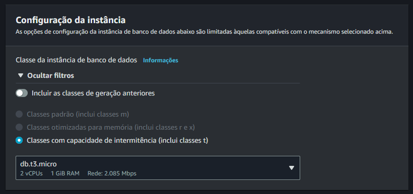

## Armazenamento

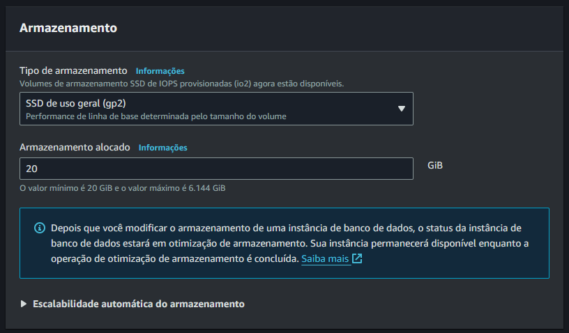

## Conectividade

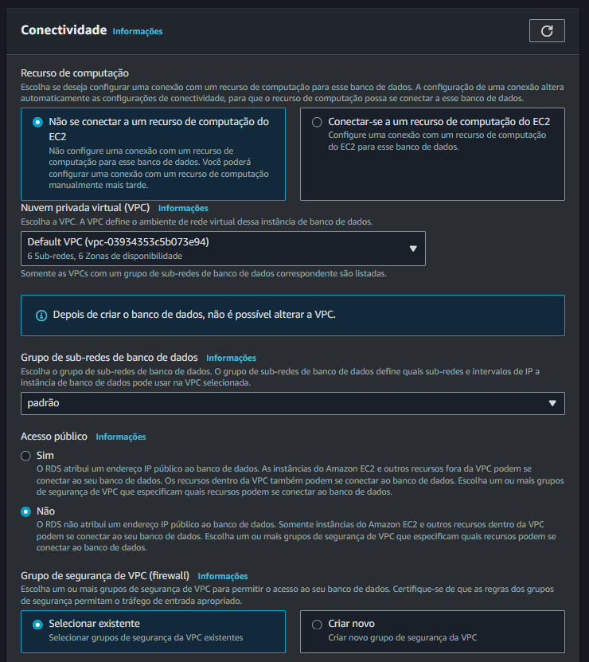

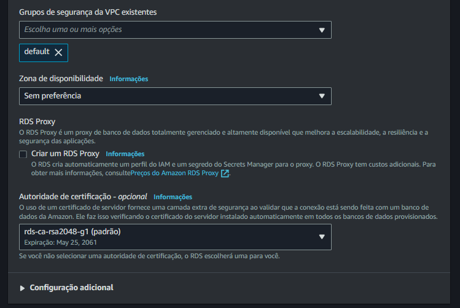

## TAG

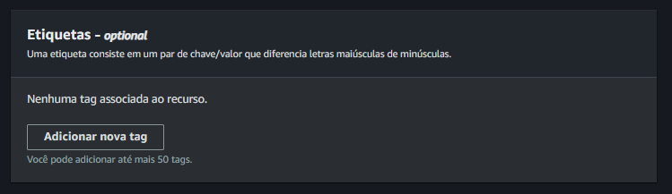

## Autenticação

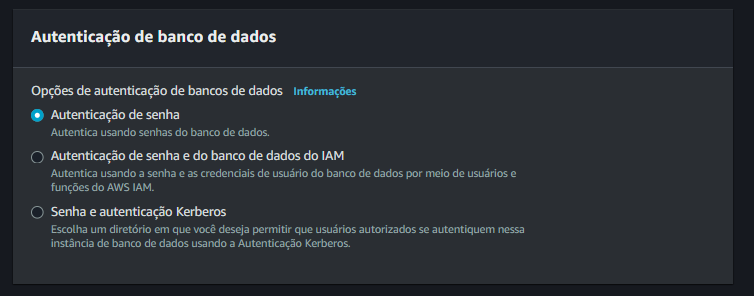

## Monitoração

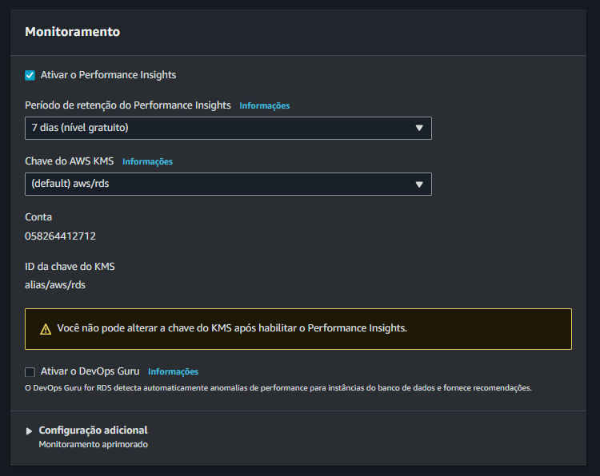

## Custos

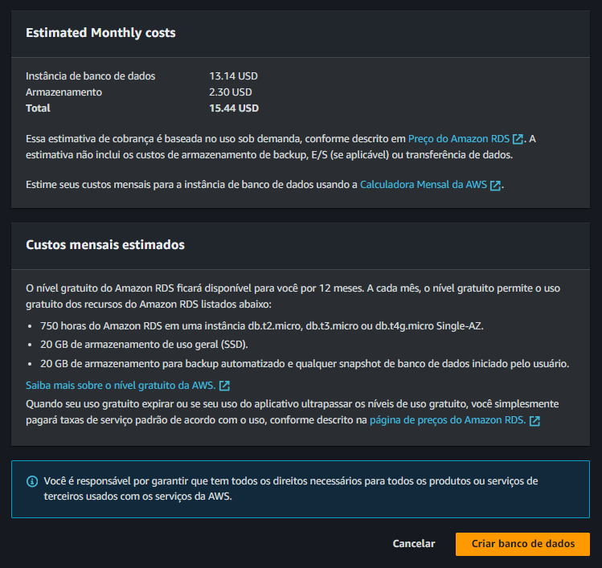

## Finalmente

`CRIAR BANCO DE DADOS`