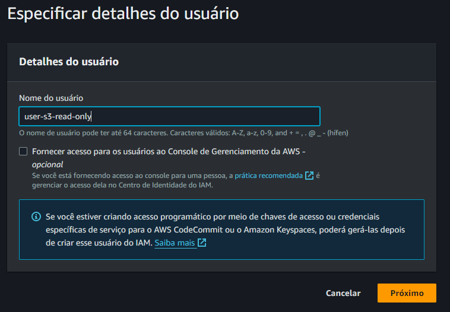
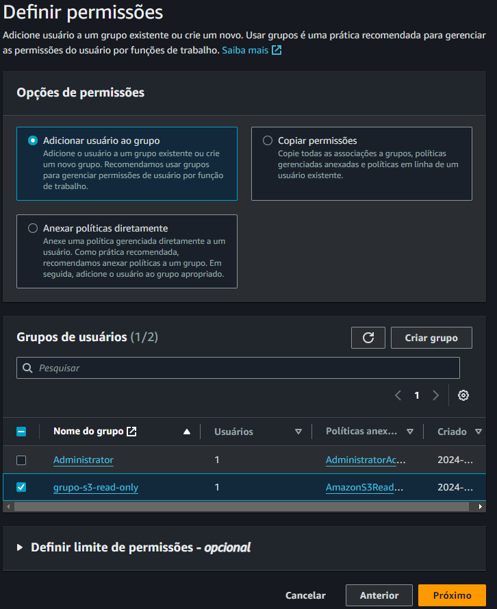
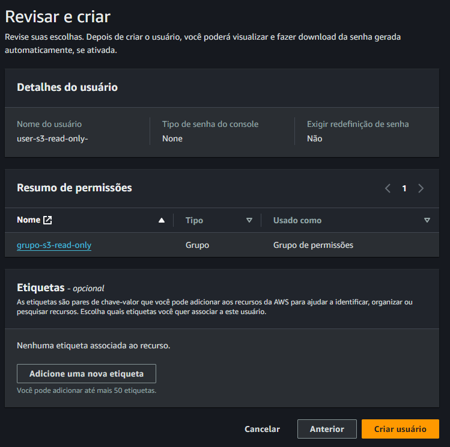
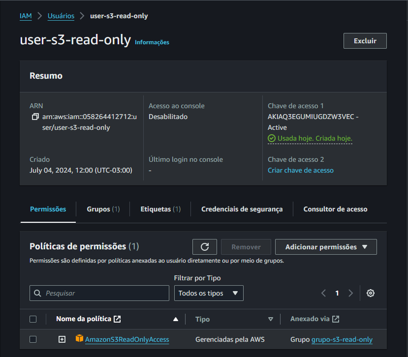
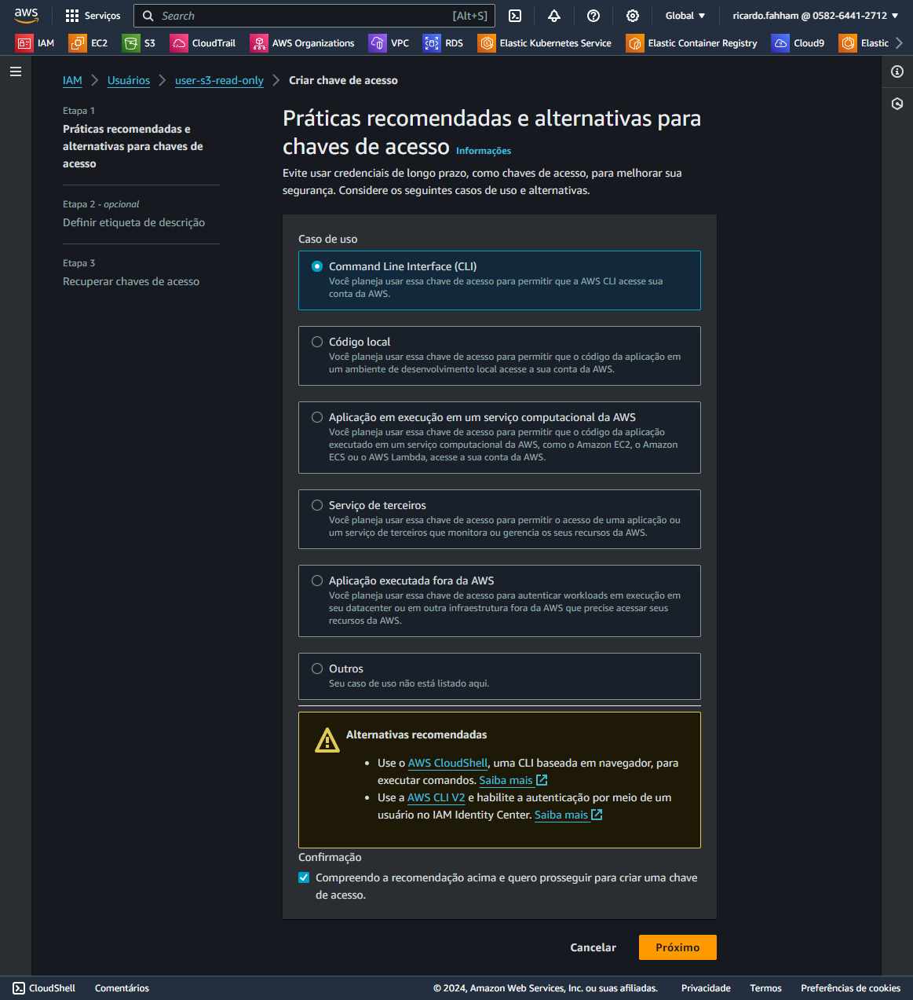

# Acessar o Bucket

Criar URL Temporária

## Criar um grupo: `grupo-s3-read-only`

Police

AmazonS3readonly

## Criar um usuário

<div align="center">



</div>

## Adicionar ao Grupo `grupo-s3-read-only`

<div align="center">



</div>


<div align="center">



</div>

## Criar Chave de Acesso

<div align="center">



</div>

## Práticas

<div align="center">



</div>

## Descrição da chave

<div align="center">


</div>

Baixar a `CHAVE`

Acessar os dados do arquivo com as credenciais

```bash
cat user-s3-read-only_accessKeys.csv
```
## Configurar o profile com as informações da credencial

```bash
aws configure --profile user-s3-read-only

AWS Access Key ID [************************]: 
AWS Secret Access Key [************************]: 
Default region name [us-eats-1]: us-east-1
Default output format [json]: json
```

## Visualizar o arquivo com as Credenciais

```bash
[user-s3-read-only]
aws_access_key_id = 
aws_secret_access_key = 
```

## Gerar a url para o arquivo, com expiração em 120 segundos

```bash
aws s3 presign s3://<nome do bucket>/<nome do objeto> --profile user-s3-read-only --expires-in 120
```

OBS.: As chaves só podem ser removidas pelo usuário `ROOT`