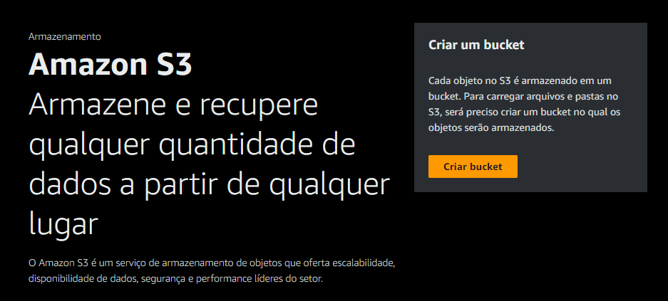
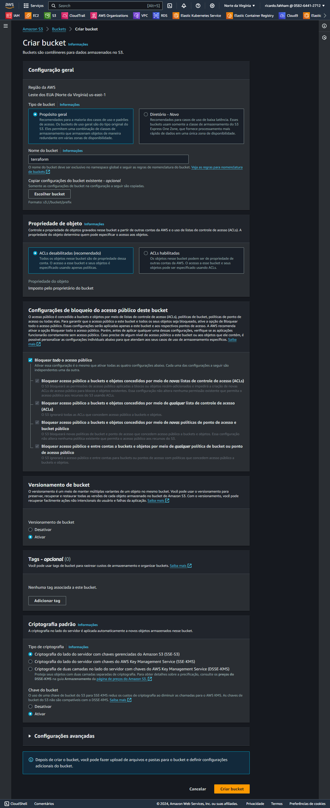
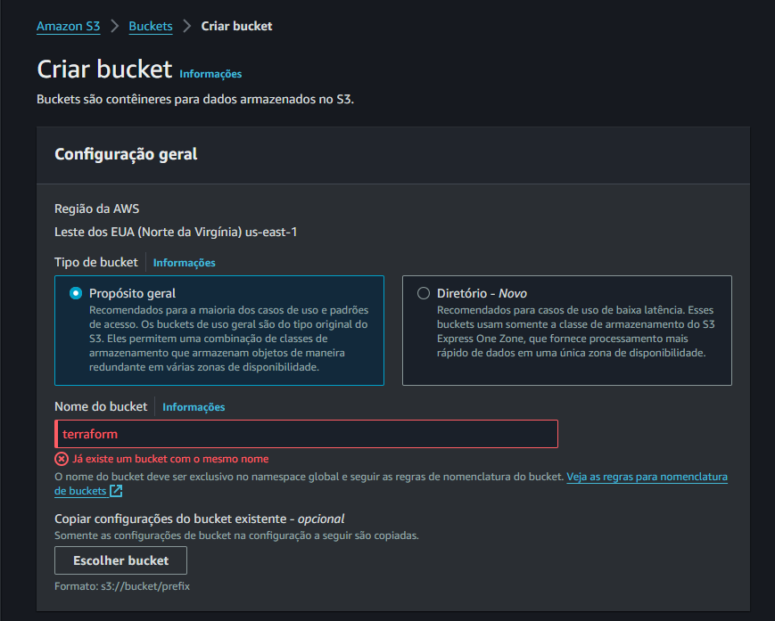
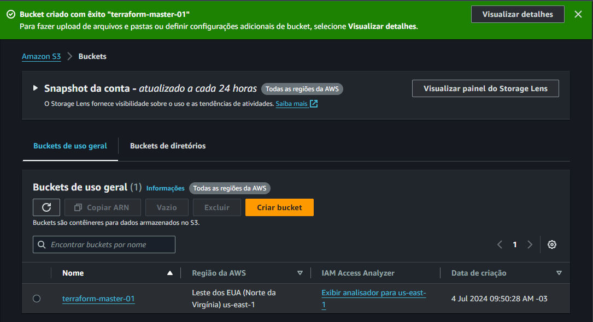

# Criando um Bucket na AWS

No console da AWS, procurar por `S3`

Clicar em `Criar Bucket`

❗ Obs.: O Bucket precisa ser único, por isso precisa de um nome que não exista a possibilidade de ter outro com o mesmo nome.

Ao criar um Bucket com o nome de Terraform, por exemplo, surgirá a mensagem de que já existe um Bucket com este nome.

O que pode ser feito é adicionar mais informações sobre o Bucket através do nome.

Exemplo: terraform-master-01

Próximo passo... [Upload do Objeto](upload.md)