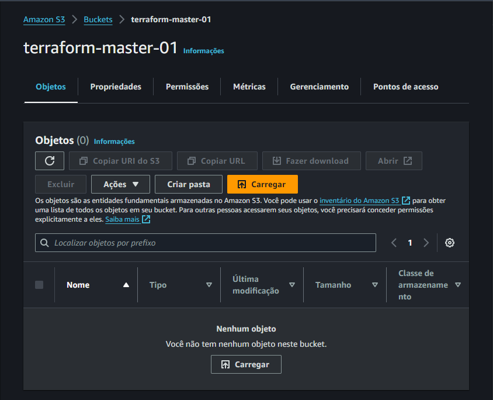
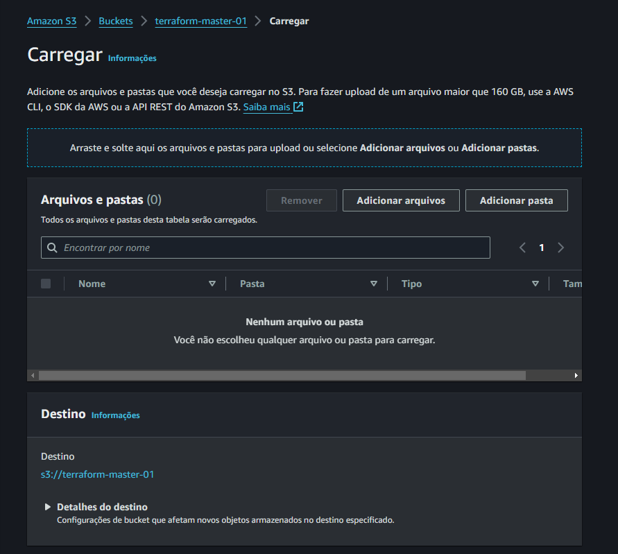
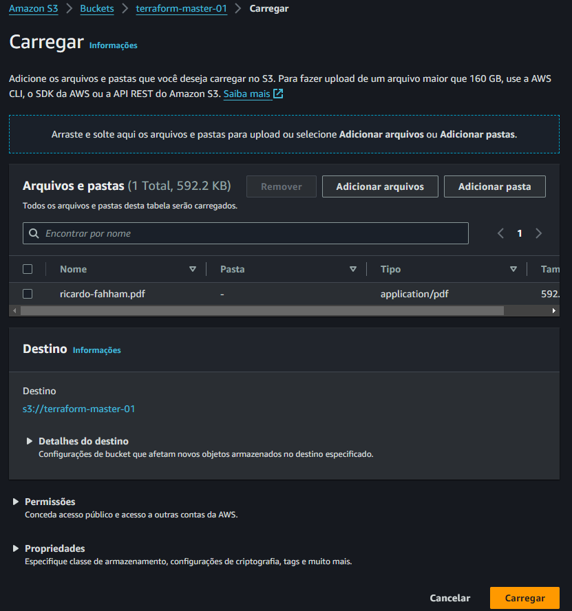
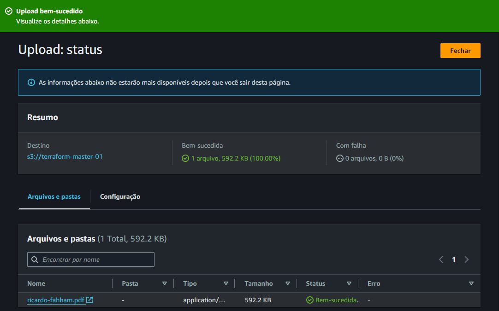

# UPLOAD de objetos

Tudo dentro do bucket é tratado como objeto

Clicar em `Carrgar`

Pode adicionar um arquivo ou uma pasta

Abrirá a opção para selecionar o arquivo/pasta

Objeto carregado

Próximo passo... [Acessar o Objeto](acessar.md)