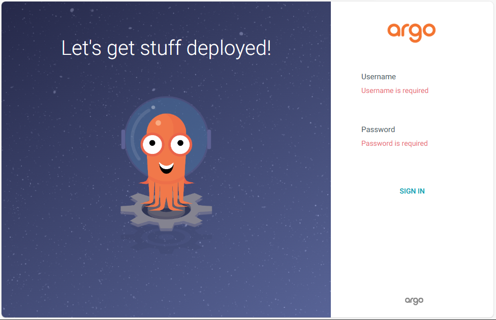
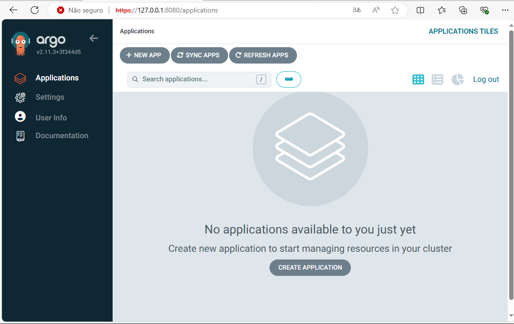

# Acessando o ArgoCD

Nesse passo vamos recuperar a senha de admin do ArgoCD que está em um secret executando o comando abaixo:

```bash
kubectl -n argocd get secret argocd-initial-admin-secret -o jsonpath="{.data.password}" | base64 -d
```

Você deve salvar o valor apresentado no seu terminal.

Agora vamos acessar a console do ArgoCD fazendo um port-forward apontando para o service do ArgoCD usando o comando abaixo:

```bash
kubectl port-forward service/argocd-server -n argocd 8080:443 -n argocd
```

Através de qualquer navegador de Internet acessar o endereço http://127.0.0.1:8080 deverá apresentar um erro de certificado mas pode ignorar esse erro. 

Deverá ser apresentada a tela abaixo:

<div align="center">



</div>

Agora você deve usar o usuário admin e a senha recuperada através do secret feito no passo anterior para acessar a console do ArgoCD. Deverá aparecer uma tela igual a abaixo:

<div align="center">



</div>

Próximo passo... [Criar repositório](repo.md)