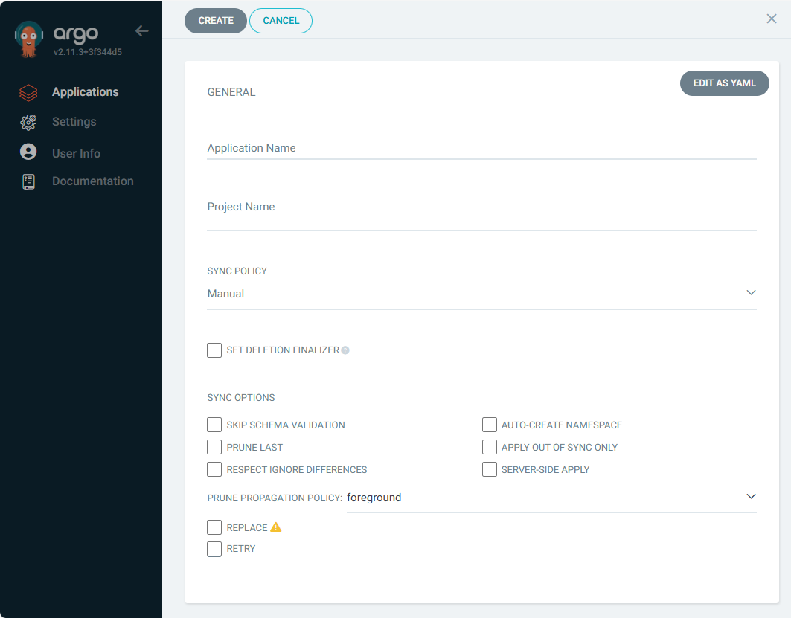

# Criação da App usando a console do ArgoCD

Para fazer a criação da nossa aplicação usando o argoCD será necssário ir no menu Applications e depois clicar na opção New App conforme imagem abaixo:

<div align="center">


</div>

Agora vamos fazer as configurações da nossa aplicação. 

Abaixo segue imagem das primeiras configurações:

<div align="center">



</div>

Em General temos as seguintes configurações abaixo:

<div align="center">


</div>

- Application Name -> vai ser o nome da nossa aplicação.

- Project Name -> podemos selecionar em qual projeto dentro do ArgoCD a nossa aplicação será criada. Como não criamos nenhum projeto vamos colocar no projeto Default que já vem criado.

- Sync Policy vamos alterar para Automatic e habilitar as duas opções abaixo:

    - Prune Resources essa opção quando habilitada faz com que o ArgoCD delete qualquer recurso que não esteja declarado no git por exemplo se alterar a quantidade de replicas de um deploy usando o comando kubectl scale.

    - Self Heal essa opção quando habilitada força que o estado do seu deploy seja igual ao que está definido no seu repositório git.

- Auto-Create Namespace caso o namespace não exista o mesmo será criado no seu cluster kubernetes.

Agora vamos partir pra segunda parte das configurações conforme imagem abaixo:

Em Source temos as seguintes configurações abaixo:

<div align="center">


</div>

- Repository URL será a Url do nosso repositório git que está a definição do nossa app.

- Revision vamos deixar o valor default que é HEAD mas podemos configurar outras branches ou tags do github.

- Path é o diretório do github onde está a definição do nosso arquivo yaml.

<div align="center">


</div>

- Em Destination temos as seguintes configurações abaixo:

<div align="center">


</div>

- Cluster URL vamos passar a URL do nosso cluster kubernetes como só temos um cluster só aparecerá apenas uma opção mas existe a possibilidade de configurar mais de um cluster.

- Namespace é o nome do namespace que será criado no nosso cluster caso não exista e onde será feito a criação da nossa aplicação.

Agora basta clicar no botão Create e será apresentado a nossa aplicação conforme abaixo:

<div align="center">


</div>

Clicando sobre o quadro da nossa aplicação você terá uma visão de todos os objectos criados no kubernetes para esse deploy conforme abaixo:

<div align="center">


</div>

## Habilitar o `port-forward`

```bash
kubectl port-forward deployment.apps/workon 8080:80

Forwarding from 127.0.0.1:8080 -> 80
Forwarding from [::1]:8080 -> 80
Handling connection for 8080
Handling connection for 8080
```

## Acessar pelo browser

http://localhost:8181

<div align="center">


</div>


## Escalando a quantidade de PODS do WORKON

```bash
kubectl scale deploy/workon --replicas 10 -n workon
deployment.apps/workon scaled
```
## Verificar se o escalonamento funcionou...rs

```bash
kubectl get pods
NAME                      READY   STATUS    RESTARTS      AGE
workon-69dccb94cb-7cnkn   1/1     Running   0             20s
workon-69dccb94cb-8kdw9   1/1     Running   0             20s
workon-69dccb94cb-fm87j   1/1     Running   0             20s
workon-69dccb94cb-mc7n7   1/1     Running   0             20s
workon-69dccb94cb-p85fn   1/1     Running   0             20s
workon-69dccb94cb-qrdb6   1/1     Running   0             20s
workon-69dccb94cb-rhgbc   1/1     Running   0             61m
workon-69dccb94cb-tbfq8   1/1     Running   0             20s
workon-69dccb94cb-xq5gl   1/1     Running   1 (58m ago)   61m
workon-69dccb94cb-xxw74   1/1     Running   0             20s
```

Próximo passo... [Atualizando projeto](update.md)


