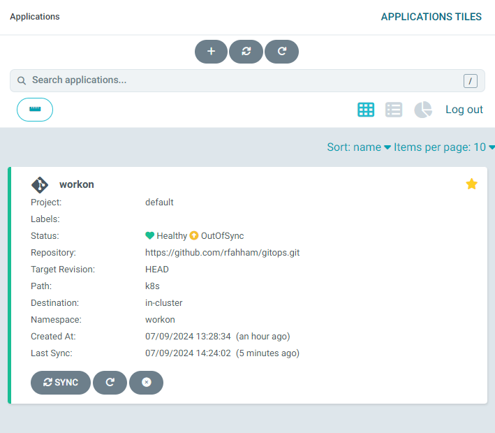

# Atualizando a versão do Deployment

Vamos mudar o código do projeto: workon, da versão 1.0.0 para 2.0.0

Alterar no deployment.yaml a imagem.

De:

    spec:
        containers:
        - name: workon
            image: rfahham/workon:1.0.0

Para:

    spec:
        containers:
        - name: workon
            image: rfahham/workon:2.0.0

Salvar a alteração no repositório

No ArgoCD

Syncronizar...

<div align="center">



</div>

Após a sincronização, atualizar o port-forward e abrir o http://127.0.0.1:8181/

```bash
kubectl port-forward deployment.apps/workon 8181:80
Forwarding from 127.0.0.1:8181 -> 80
Forwarding from [::1]:8181 -> 80
Handling connection for 8181
Handling connection for 8181
Handling connection for 8181
```

Versão atualizada !!!

<div align="center">


</div>

Próximo passo... [CI-CD](cicd.md)


