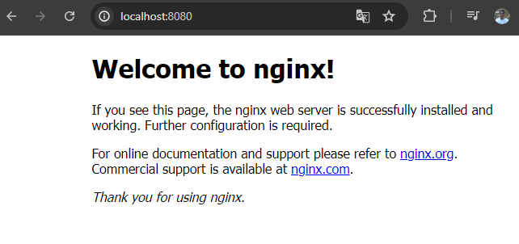

# Criando um container e acessando via browser

```bash
docker container run -d -p 8080:80 nginx
Unable to find image 'nginx:latest' locally
latest: Pulling from library/nginx
2cc3ae149d28: Pull complete 
1018f2b8dba8: Pull complete 
b831e78d8e20: Pull complete 
3ab22521e919: Pull complete 
5112bf42775b: Pull complete 
cbdaf9e4ee2d: Pull complete 
a06b6fd631e8: Pull complete 
Digest: sha256:9c367186df9a6b18c6735357b8eb7f407347e84aea09beb184961cb83543d46e
Status: Downloaded newer image for nginx:latest
30c124552d59e288b23e019725b0ea00d33f66b54f52da9be2af14df14035b86
```

<div align="center">



</div>

Acessar o Container

```bash
docker container exec -it 30c124552d59e288b23e019725b0ea00d33f66b54f52da9be2af14df14035b86 /bin/bash
```

Alterar o conteúdo da página do NGINX

vim /usr/share/nginx/html/index.html

