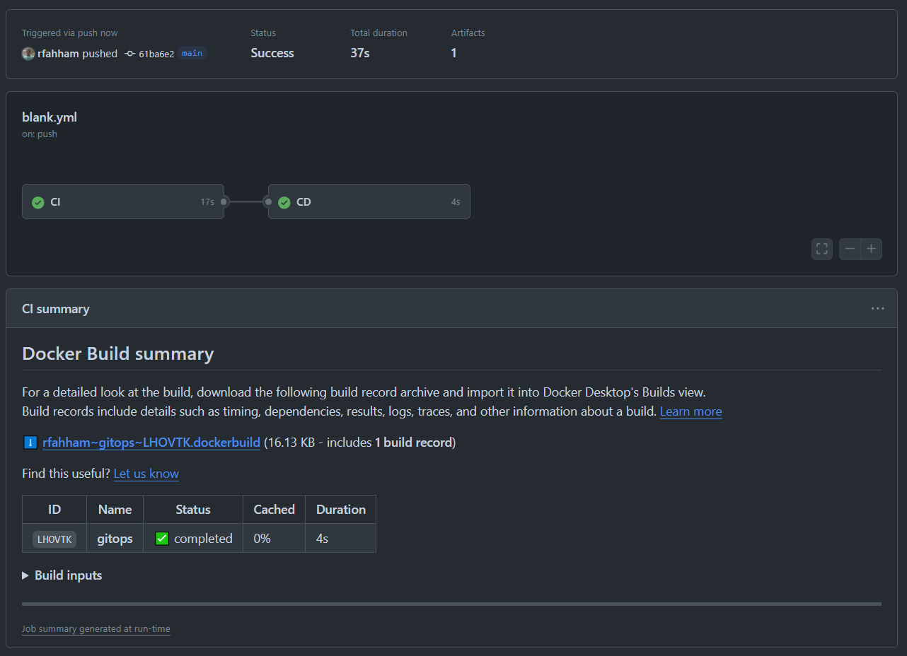
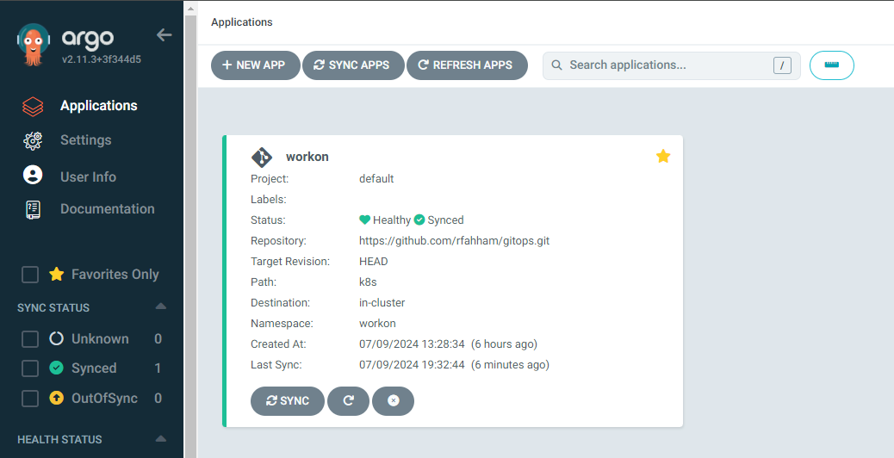
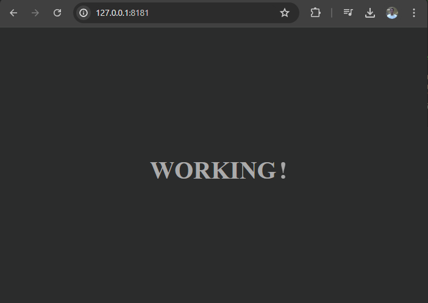

# Implementação do CI/CD

[Repositório do Projeto](https://github.com/rfahham/gitops)

Para criar o processo de `CI & CD` precisamos:

1 - Criar o repositório do [projeto no github](https://github.com/rfahham/gitops)

2 - O projeto que será deployado, [nesse caso usei um index.html](https://github.com/rfahham/gitops/blob/main/index.html)

3 - [Dockerfile](https://github.com/rfahham/gitops/blob/main/Dockerfile) com a construção da imagem

4 - O arquivo de configuração do [gitactions](https://github.com/rfahham/gitops/blob/main/.github/workflows/blank.yml)

5 - O manifesto do projeto, [deployment.yaml](https://github.com/rfahham/gitops/blob/main/k8s/deployment.yaml)

Depois de configurado todo o processo, quando realizar o commit e push no repositório, será inicializado o processo de deploy.

<div align="center">



</div>

Tudo funcionando, o próximo passo será fazer a sincronização no ARGOCD.

<div align="center">



</div>

Com isso a imagem será atualizada nos `pods` da aplicação em `kubernetes`

## Verificando a saúde dos PODS

```bash
kubectl get pods
NAME                      READY   STATUS    RESTARTS      AGE
workon-69dccb94cb-rhgbc   1/1     Running   0             50m
workon-69dccb94cb-xq5gl   1/1     Running   1 (47m ago)   50m
```

## Verificando a versão da imagem

```bash
kubectl describe pod workon-69dccb94cb-xq5gl | grep Image

Image:          rfahham/workon:v17
Image ID:       docker.io/rfahham/workon@sha256:afc96300dc09c563421a880e9eef0721f1d6ec24a7ab91fa7fa4c5820996492d
```

## Fazer o port-forward

```bash
kubectl port-forward deployment.apps/workon 8181:80
```
<div align="center">



</div>

Ao atualizar o projeto, `index.html` o processo de `CI & CD` será executado automaticamente. Atualizando a imagem dos pods.

Próximo passo... [Criação da aplicação via linha de comando](criar-app-cli.md)