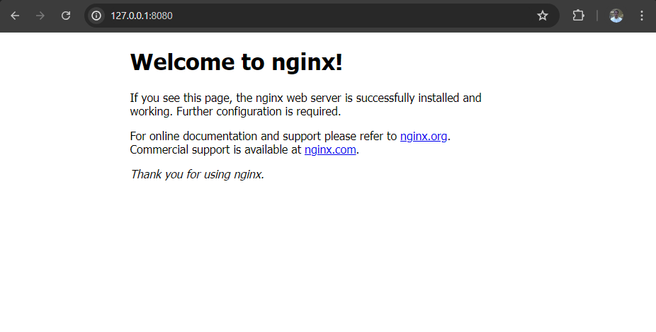

# Criação da aplicação via linha de comando

No passo anterior criamos a nossa aplicação usando a console do ArgoCD mas podemos também criar via linha de comando usando o kubectl. 

Para isso criar um arquivo chamado [nginx.yaml](./deployments/nginx.yaml) com conteúdo abaixo:

```bash
apiVersion: argoproj.io/v1alpha1
kind: Application
metadata:
  name: nginx
  namespace: argocd
spec:
  project: default
  source:
    repoURL: 'https://github.com/jjasonhenrique/nginx-example.git'
    path: deploy
    targetRevision: HEAD
  destination:
    server: 'https://kubernetes.default.svc'
    namespace: nginx
  syncPolicy:
    automated:
      prune: true
      selfHeal: true
    syncOptions:
      - CreateNamespace=true
```

Depois disso executar o comando abaixo para criação da aplicação:

```bash
kubectl apply -f nginx.yaml

application.argoproj.io/nginx created
```

Para verificar o estado na sua aplicação no ArgoCD você pode usar o comando abaixo:

```bash
kubectl get apps -n argocd

NAME     SYNC STATUS   HEALTH STATUS
nginx    Synced        Healthy
workon   Synced        Healthy
```

```bash
kubectl get pods -n argocd
NAME                                               READY   STATUS      RESTARTS       AGE
argocd-application-controller-0                    1/1     Running     0              23h
argocd-applicationset-controller-c5d4586ff-nj9fh   1/1     Running     6 (110m ago)   23h
argocd-dex-server-6fff54b8f9-b7886                 1/1     Running     0              23h
argocd-notifications-controller-775ccf78db-sdqbj   1/1     Running     3 (113m ago)   23h
argocd-redis-56f6c644c5-rf8p4                      1/1     Running     3 (111m ago)   23h
argocd-redis-secret-init-9znbn                     0/1     Completed   0              23h
argocd-repo-server-864d9c575b-p9vl6                1/1     Running     0              23h
argocd-server-8b6b76b46-6mn7d                      1/1     Running     0              23h
```

## Validação

Nesse passo vamos fazer uma alteração manual na nossa aplicação diretamente no cluster alterando o número de replicas para 10 usando o comando abaixo:

```bash
kubectl scale deploy/nginx --replicas 10 -n nginx

deployment.apps/nginx scaled
```

Você irá perceber que instantaneamente serão terminados vários pods e ficará apenas 2 pods como Running conforme está configurado na definição que está no [git](https://github.com/jjasonhenrique/nginx-example/blob/main/deploy/nginx.yaml). 

Isso é o conceito de reconcile do ArgoCD. 

Abaixo você pode ver uma imagem com os pods sendo terminados:

```bash
kubectl get pods -n nginx

NAME                     READY   STATUS        RESTARTS   AGE
nginx-7854ff8877-7kmzz   0/1     Terminating   0          4s
nginx-7854ff8877-8c8lj   0/1     Terminating   0          4s
nginx-7854ff8877-9c6sv   1/1     Running       0          23m
nginx-7854ff8877-9cml2   0/1     Terminating   0          4s
nginx-7854ff8877-h7r5q   0/1     Terminating   0          4s
nginx-7854ff8877-hmx9l   1/1     Running       0          23m
nginx-7854ff8877-nxc6p   1/1     Terminating   0          4s
nginx-7854ff8877-rpjwc   1/1     Terminating   0          4s
```

Você também pode verificar os eventos do kubernetes usando o comando abaixo:

```bash
kubectl get events -n nginx
```

## PORT-FORWARD

```bash
kubectl port-forward deployment.apps/nginx -n nginx 8080:80

Forwarding from 127.0.0.1:8080 -> 80
Forwarding from [::1]:8080 -> 80
Handling connection for 8080
Handling connection for 8080
Handling connection for 8080
Handling connection for 8080
```

<div align="center">



</div>

## Deletar a aplicação

O Comando abaixo não funciona, porque precisa do deployment.yaml para ser apagado, é o manifesto que permite a criação e deleção dos pods. 

```bash
kubectl delete -f nginx.yaml

application.argoproj.io "nginx" deleted
```

Neste caso, para apagar os pods:

```bash
kubectl delete -f /nginx/deployment.yaml
```

Apagar o namespace

```bash
kubectl delete namespace nginx
```

## Conclusão

O objetivo desse artigo foi explicar um pouco sobre GitOps, demonstrar a instalação do ArgoCD e a criação de uma aplicação usando um repositório git.

Lembrando que a forma como foi instalado o ArgoCD é apenas pra testes. Para ambiente de produção é recomendável a criação do ArgoCD no modo HA.

