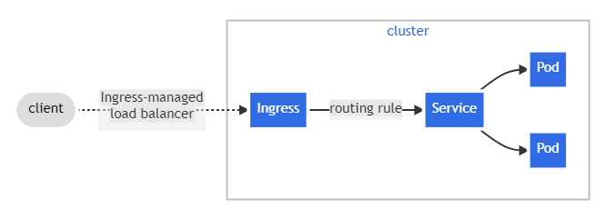

# Ingress

fonte: https://kubernetes.io/docs/concepts/services-networking/ingress/

Disponibilize seu serviço de rede HTTP (ou HTTPS) usando um mecanismo de configuração com reconhecimento de protocolo, que entende conceitos da web como URIs, nomes de host, caminhos e muito mais. O conceito Ingress permite que você mapeie o tráfego para diferentes backends com base em regras que você define por meio da API do Kubernetes.

## O que é o Ingress?
O Ingress expõe rotas HTTP e HTTPS de fora do cluster para serviços dentro do cluster. O roteamento de tráfego é controlado por regras definidas no recurso Ingress.

Aqui está um exemplo simples onde um Ingress envia todo o seu tráfego para um Serviço:

<div align=center>

</div>

O recurso Ingress
Um exemplo mínimo de recurso do Ingress:

```bash
service/networking/minimal-ingress.yaml Copiar service/networking/minimal-ingress.yaml para a área de transferência
apiVersion: networking.k8s.io/v1
kind: Ingress
metadata:
  name: minimal-ingress
  annotations:
    nginx.ingress.kubernetes.io/rewrite-target: /
spec:
  ingressClassName: nginx-example
  rules:
  - http:
      paths:
      - path: /testpath
        pathType: Prefix
        backend:
          service:
            name: test
            port:
              number: 80
```
