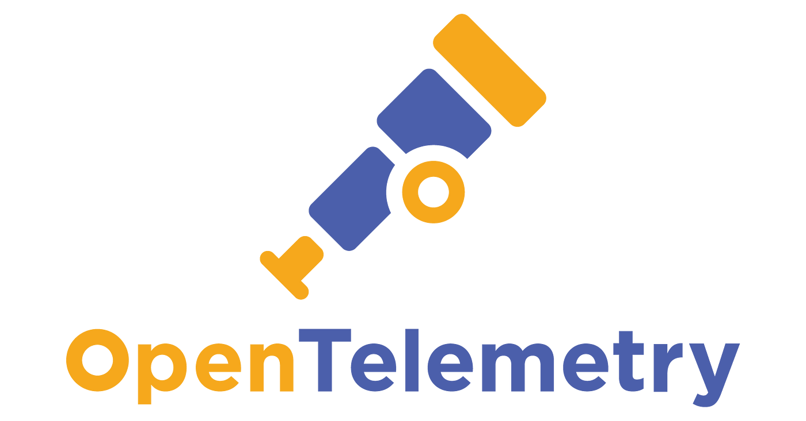

# OpenTelemetry

CNCF - Cloud Native Computing Foundation

O primeiro projeto do CNCF é o Kubernetes, o novo Sistema Operacional.

O segundo projeto da CNCF é o OpenTelemetry.

Vendor = GCP, AWS, AZURE

## O que é o OpenTelemetry?

É um framework de observabilidade para Cloud Native

Composto de ferramentas, APIs, SDKs

- Ferramentas

- APIs

- SDKs

## Componentes principais

- Especificações
    - Dados
    - SDKs
    - APIs

- Collector
    - Agente ou serviçco - Coleta os dados de telemetria
    - Pipeline
        - Recebimento dos dados
        - Processamento dos dados
        - Envio dos dados
    - Vendor-agnostic
- Libs
    - Vendor-agnostic, preparar o software para ser usado para qualquer plataforma. GCP, AWS, AZURE, mas sim pra qualquer Vendor que tenha suporte para o OpenTelemetry.
    - Tracing e Logs
    - Auto Tracing

## Sem collector

A Aplicação fala diretamente com o Vendor

Envia Metrics and Tracing para o Vendor1

Envia Logos para o Vendor2

O problema é fazer um acoplamento muito alto, caso tenha algum problema, pode aumentar a latência da própria aplicação.

## Com coletor no modo de agente

SideCar
No Servidor tem a Aplicação e o agente que vai pegar os dados da aplicação, o Collector agente envia os Metrics, Tracing and logs para os Vendors

Exemplo: 

Usando o Helm para subir uma imagem, o agente também é instalado.

APP + Collector Agente

## Com coletor no modo de Servidor

Usado para centralizar os dados coletados.

Pensando em Resiliência

Exemplo:

Um servidor com APP + Um servidor com Collector e o Collector envia os dados para os Vendors

## Instrumentação

Instrumentação, geração, coleta e exportação de dados de telemetria

- Instrumentação Manual
    - Você pode filtrar as informações que vc quer. 

- Instrumentação Automática
    - Não precisa mudar o código

Próximo passo... [Instalação do Open Telemetry](instalacao.md)

