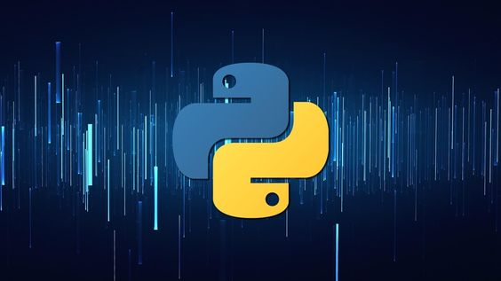

O Tutorial Python

> Python é uma linguagem de programação poderosa e fácil de aprender. Ela tem estruturas de dados de alto nível eficientes e uma abordagem simples, mas eficaz, para programação orientada a objetos. A sintaxe elegante e a tipagem dinâmica do Python, juntamente com sua natureza interpretada, fazem dele uma linguagem ideal para scripts e desenvolvimento rápido de aplicativos em muitas áreas na maioria das plataformas.

> O interpretador Python e a extensa biblioteca padrão estão disponíveis gratuitamente em formato de código-fonte ou binário para todas as principais plataformas no site do Python, https://www.python.org/ , e podem ser distribuídos gratuitamente. O mesmo site também contém distribuições e ponteiros para muitos módulos, programas e ferramentas Python de terceiros gratuitos, além de documentação adicional.

> O interpretador Python é facilmente estendido com novas funções e tipos de dados implementados em C ou C++ (ou outras linguagens que podem ser chamadas de C). Python também é adequado como uma linguagem de extensão para aplicativos personalizáveis.

> Este tutorial introduz o leitor informalmente aos conceitos básicos e recursos da linguagem e do sistema Python. Ajuda ter um interpretador Python à mão para experiência prática, mas todos os exemplos são autocontidos, então o tutorial pode ser lido off-line também.

> Para uma descrição de objetos e módulos padrão, veja The Python Standard Library . O Python Language Reference fornece uma definição mais formal da linguagem. Para escrever extensões em C ou C++, leia Extending and Embedding the Python Interpreter e Python/C API Reference Manual . Há também vários livros que abordam Python em profundidade.

> Este tutorial não tenta ser abrangente e cobrir cada recurso, ou mesmo todos os recursos comumente usados. Em vez disso, ele apresenta muitos dos recursos mais notáveis ​​do Python e lhe dará uma boa ideia do sabor e estilo da linguagem. Depois de lê-lo, você será capaz de ler e escrever módulos e programas Python, e estará pronto para aprender mais sobre os vários módulos da biblioteca Python descritos em The Python Standard Library .

Próximo passo...[Sobre as variáveis](./variaveis.md)