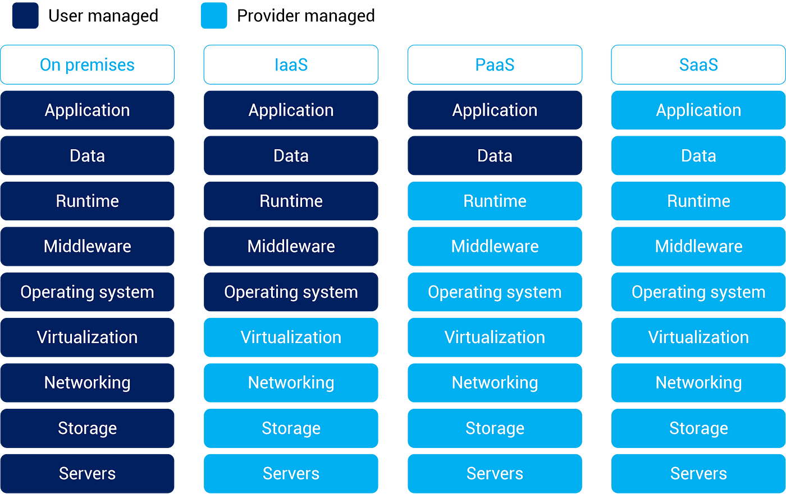

# Cloud On-Premises X Cloud Pública

## Cloud On-Premises

> Data Center ou centro de procesamento de dados

É um prédio ou área feita para concentrar servidores, equipamentos de processamento e armazenamento de dados.

> Objetivo

Atender demandas computacionais de uma ou mais empresas que trabalham com aplicações e banco de dados com sistema comlexo de rede onde se concentram switches, cabos, roteadores e etc.

> Caratcterísticas

- Hardware físicos - Necessidade de investimento inicial

- Compra de licenças

- Mais seguros que Cloud (95% dos erros de segurança em cloud são por erros de usuários)

- Escalabilidadde lenta e burocrática

- Disponibilidade complexa (24 X 7)

> Investimento

- Servidores de uma categoria intermediária vale em média 20 mil reais, Custo de um data center pode chegar a Bilhões.

> Cloud Pública Vs On Premises

- Infraestrutura

    - Cloud Pública
        - Oferece Serviço, cuida e é responsável
    - On-Premises
        - A empresa que cuida, é responsável. $$$

- Investimento
    
    - Cloud Pública
        - Paga o que usar
    - On Premises
        - Arca com todas as despesas, compra e manutenção. $$$

- Despesas Fixas X Pague o que usar

    - Cloud Pública
        - Pessoas que irão utilizar o serviço - Desenvovedores, devops, DBs
    - On Premises
        - Todas as despesas fixas - pessoal de segurança, rede, manutenção física, suporte. (24 X 7) $$$

- Segurança

    - Cloud Pública
        - Como serviço, precisa só de ter conhecimento do que está fazendo.
    - On Premises
        - Equipe contratada que cuida. Time de segurança. $$$

- Flexibilidade

    - Cloud Pública
        - Usar o que precisar
    - On Premises
        - A infra que está no Datacenter, se precisar de mais poder computacional, precisa comprar mais servidores. $$$

- Disponibilidade

    - Cloud Pública
        - 99.9999%
    - On Premises
        - Depende de muitos fatores, mas busca os 99.9999%

- Manutenção

    - Cloud Pública
        - 24 X 7 - Software, licença, update de versões
    - On Premises
        - Depende de equipe contratada $$$

## Tipos de serviços

- On premises
    
    Datacenter privado - Times cuidando

- IaaS

    Infraestrutura como serviço
    - EC2
    - SO

- PaaS

    Plataforma como serviço
    - Desenvolvimento 
    - Dados 
    - Aplicações

- SaaS

    Software como serviço
    - APIS
    - Gmail
    - Canva
    - Aplicações que são utilizadas
 